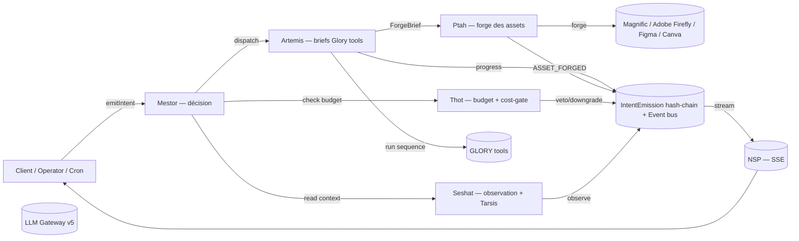

# La Fusée `v5.4`

**L'Industry OS du marché créatif africain.** Construit par l'agence **UPgraders**.

> **Mission (north star)** : transformer des marques en icônes culturelles, en
> industrialisant l'accumulation de superfans qui font basculer la fenêtre
> d'Overton dans leur secteur. Tout le reste — Neteru, Oracle, Glory tools,
> ADVERTIS, APOGEE, les 4 portails — n'existe que pour servir cette mécanique.
> Voir [docs/governance/MISSION.md](docs/governance/MISSION.md).

> **Statut refonte** : 95% pondéré (Coverage 100 / Framework 100 / Governance 85
> / Mission 98). Inventaire honnête des résidus dans
> [docs/governance/RESIDUAL-DEBT.md](docs/governance/RESIDUAL-DEBT.md).

> Un brief client arrive en PDF. 48h plus tard, la marque est diagnostiquée,
> la stratégie est écrite, les missions sont en production, et les freelances
> livrent.

---

## Le problème

Aucune structure de classe mondiale ne sert correctement le marché créatif en
Afrique francophone.

Les groupes internationaux (Havas, Publicis, WPP) maintiennent des bureaux à
Abidjan, Douala, Dakar — des boîtes aux lettres. Leurs méthodologies restent à
Paris ou Londres. Le client africain reçoit un service de tier 3 au prix du
tier 1.

Les agences locales ont du talent, de l'intuition, de la débrouillardise. Mais
rien de codifié, rien de reproductible, rien de mesurable. Chaque projet est un
artisanat. C'est ce qui empêche le marché de scaler.

## La solution

La Fusée **industrialise** la chaîne de valeur créative — du brief au livrable,
du diagnostic au paiement :

- **Un brief entre** → l'OS le scanne, identifie la marque, diagnostique ses 8
  piliers ADVE-RTIS, génère la stratégie, dispatche les missions aux bons
  talents.
- **Un opérateur supervise** → il pilote, ne produit plus. L'IA propose,
  l'humain valide. Chaque décision est tracée (hash-chained), chaque livrable
  est scoré, chaque franc dépensé est gouverné par Thot.
- **Les marques montent en puissance** → trajectoire **APOGEE** en 6 paliers
  (`ZOMBIE → FRAGILE → ORDINAIRE → FORTE → CULTE → ICONE`). Chaque palier a ses
  preuves et ses gates ; pas de saut, pas de régression silencieuse.
- **Les créatifs sont structurés** → tier system, matching automatique, QC,
  paiement. Un freelance à Douala peut livrer un KV pour une marque à Abidjan
  sans dispatch humain.

---

## Comment ça marche — le Panthéon NETERU

L'OS est gouverné par **5 Neteru actifs + 2 pré-réservés** (plafond APOGEE = 7). Source de vérité narrative complète : [docs/governance/PANTHEON.md](docs/governance/PANTHEON.md).



| Neteru | Rôle | Loi |
|---|---|---|
| **Mestor** | Guidance — décision. Point d'entrée unique pour toute mutation métier (`mestor.emitIntent`). | LOI 1 — chaque mutation traverse Mestor. |
| **Artemis** | Propulsion (phase brief) — exécute Glory tools rédactionnels. Output texte structuré (concept, copy, script, brand-bible, kv-prompt). Brief-to-forge tools handoff à Ptah. Livrable phare : **l'Oracle** (21 sections). | LOI 2 — Artemis ne décide pas, elle produit. |
| **Seshat** | Telemetry — observation + Tarsis (signaux faibles) + ranker cross-brand. Read-only, échec silencieux par contrat. Asset-impact-tracker post-Ptah. | LOI 3 — Seshat n'écrit jamais. |
| **Thot** | Sustainment + Operations — cerveau financier. Veto / downgrade / record cost. Pillar 6 cost-gate. ROI tables par manipulation mode. | LOI 4 — pas de combustion sans propellant. |
| **Ptah** | Propulsion (phase forge) — matérialise les briefs Artemis en assets concrets via Magnific / Adobe Firefly / Figma / Canva. Activation Phase 9 ([ADR-0009](docs/governance/adr/0009-neter-ptah-forge.md)). | LOI 2bis — Ptah forge ce qu'Artemis prescrit, jamais en bypass. |
| **Imhotep** *(pré-réservé Phase 7+)* | Crew Programs — talent matching + formation + qc-router. ([ADR-0010](docs/governance/adr/0010-neter-imhotep-crew.md)) | — |
| **Anubis** *(pré-réservé Phase 8+)* | Comms — messages cross-portail + ad networks + social posting + broadcast. KPI = `cost_per_superfan_recruited`. ([ADR-0011](docs/governance/adr/0011-neter-anubis-comms.md)) | — |

Outils transverses :

- **Notoria** — moteur de recommandation. Mestor lead, Artemis exécutant.
  Pipeline `GENERATE_RECOMMENDATIONS → APPLY_RECOMMENDATIONS` avec rollback
  possible (`DISCARD_RECOMMENDATIONS` / `REVERT_RECOMMENDATIONS`).
- **Jehuty** — feed d'intelligence stratégique cross-brand. Organe de presse
  de Seshat ; Bloomberg Terminal de la marque.
- **Pillar Gateway** — toute écriture sur un pilier passe par lui. Versioning
  immutable, audit trail, confidence tracking, validation Bible.

---

## ADVE-RTIS — la cascade qui propulse

8 piliers, scoring sur 200 :

| | Pilier | Ce qu'on mesure |
|---|---|---|
| **A** | Authenticité | L'ADN. Qui est cette marque, vraiment ? |
| **D** | Distinction | Ce qui la rend unique face à la concurrence |
| **V** | Valeur | Ce qu'elle apporte concrètement au client |
| **E** | Engagement | Sa capacité à créer des fans, pas juste des clients |
| **R** | Risque | Ses vulnérabilités et comment les couvrir |
| **T** | Track | La réalité du marché — chiffres, pas opinions |
| **I** | Innovation | Son potentiel inexploité |
| **S** | Stratégie | Le plan pour passer de où elle est à où elle veut aller |

Cascade unidirectionnelle `A → D → V → E → R → T → I → S` (sauf re-entry
explicite). Chaque pilier alimente le suivant. Voir [APOGEE.md](docs/governance/APOGEE.md)
pour les Trois Lois de Trajectoire.

---

## Trajectoire APOGEE — du sol à l'Apex

| # | Palier | Altitude | Signal |
|---|---|---|---|
| 1 | ZOMBIE | Sol | La marque existe à peine — fantôme sectoriel |
| 2 | FRAGILE | Décollage | Substance amorcée, propulsion intermittente |
| 3 | ORDINAIRE | Bas plafond | Présente, oubliable — interchangeable |
| 4 | FORTE | Plafond moyen | Distinction lisible, premiers fans organiques |
| 5 | CULTE | Plafond haut | Évangélistes en orbite, l'axe sectoriel frémit |
| 6 | **ICONE** | **Apex** | Référence patrimoniale — Overton déplacé, secteur ré-orienté |

3 sentinelles cron veillent au régime apogée : `MAINTAIN_APOGEE`,
`DEFEND_OVERTON`, `EXPAND_TO_ADJACENT_SECTOR` — voir
[/api/cron/sentinels](src/app/api/cron/sentinels/route.ts).

---

## Les 4 portails

| Portail | Pour qui | Ce qu'il fait |
|---|---|---|
| **Console** | UPgraders / Fixer | Pilote toute l'industrie — clients, diagnostics, missions, talents, gouvernance |
| **Cockpit** | Founder / marque | Voit son score, ses piliers, ses livrables, sa stratégie |
| **Creator** | Freelance / talent | Voit les missions disponibles, claim, livre, monte en tier |
| **Agency** | Agence partenaire | Gère ses clients, missions, revenus, contrats |
| **Intake** | Prospect public | Remplit un formulaire ; l'IA fait le reste |

---

## Gouvernance — IntentEmission hash-chain

Toute mutation métier crée une ligne `IntentEmission` (hash-chained, tampering
détectable). 3 niveaux d'enforcement :

1. **`governedProcedure(kind)`** (Pillar 4 préconditions + Pillar 6 cost-gate +
   post-conditions) — le standard cible.
2. **`auditedProcedure`** (strangler middleware) — audit-trail seul, kind
   `LEGACY_MUTATION`. État courant pour 60 routers / 253 mutations migrés.
3. **Public/auth procedures** — IntakePayment, NextAuth flows ; trail séparé
   par leur table dédiée.

UI d'inspection + compensation : [/console/governance/intents](src/app/(console)/console/governance/intents/page.tsx).
Bouton **Compensate** sur chaque mutation réversible (mapping
`COMPENSATING_MAP` : WRITE_PILLAR → ROLLBACK_PILLAR, PROMOTE_* → DEMOTE_*, etc.).

---

## Stack technique

| Composant | Technologie |
|---|---|
| Framework | Next.js 15, App Router, Turbopack |
| Language | TypeScript 5.8 strict |
| API | tRPC v11 + React Query v5 |
| Database | PostgreSQL via Prisma 6 (141 modèles) |
| Auth | NextAuth v5 (RBAC + MFA TOTP) |
| AI | LLM Gateway v5 multi-vendor — Anthropic primaire, OpenAI/Ollama fallback, circuit breaker, cost tracking |
| RAG | Multi-provider embeddings (Ollama → OpenAI → no-op) + V5.4 generic ranker |
| Streaming | NSP (Neteru Streaming Protocol) — SSE keyed on intentId |
| Collab | StrategyDoc + `collab-doc` service (Yjs-compatible opaque-bytes + optimistic concurrency) |
| PWA | Service worker + manifest.webmanifest (cache-first static, network-first HTML, /api bypass) |
| Tests | Vitest (unit) + Playwright (E2E, 11 suites) |
| Deploy | Vercel (4 crons : scheduler, feedback-loop, founder-digest, sentinels) |
| Plugin | `@lafusee/sdk` + sandbox proxy (cf. ADR-0008) |

---

## Chiffres au commit courant

| Métrique | Valeur |
|---|---|
| Pages / routes | 170 |
| Fichiers TypeScript | 764 |
| Routeurs tRPC | 73 |
| Services backend | 80 (79 manifests, `utils` exclu) |
| Manifest capabilities | 366 |
| Intent kinds catalogués | 47 |
| Modèles Prisma | 141 |
| Serveurs MCP | 9 (8 outbound + 1 inbound `advertis-inbound`) |
| Glory Tools | 91 |
| Sequences Artemis | 31 |
| Frameworks diagnostiques | 24 |
| ADRs | 8 (acceptés) |
| E2E suites Playwright | 11 |
| Cron endpoints | 4 |

---

## Démarrage rapide

```bash
git clone https://github.com/xtincell/ADVE-project.git
cd ADVE-project
npm install
cp .env.example .env   # voir variables requises ci-dessous
npx prisma migrate dev
npm run dev             # → http://localhost:3000
```

### Variables d'environnement

**Requises** :

- `DATABASE_URL` — connexion Postgres
- `ANTHROPIC_API_KEY` — primaire LLM
- `NEXTAUTH_SECRET` — auth + signed-state OAuth (≥32 chars)

**Optionnelles** :

- `OPENAI_API_KEY`, `OLLAMA_BASE_URL` — fallbacks LLM Gateway
- `RESEND_API_KEY` ou `SENDGRID_API_KEY` — délivrance email (sinon log)
- `STRIPE_SECRET_KEY`, `CINETPAY_API_KEY`, `PAYPAL_CLIENT_ID` — paiement
- `INTEGRATION_TOKEN_KEY` — chiffrement AES-GCM des tokens OAuth (≥32 chars)
- `GOOGLE_OAUTH_CLIENT_ID/SECRET`, `LINKEDIN_OAUTH_CLIENT_ID/SECRET`,
  `META_OAUTH_CLIENT_ID/SECRET` — providers OAuth pour `/console/config/integrations`
- `CRON_SECRET` — bearer pour les routes `/api/cron/*`
- `DEFAULT_OPERATOR_BUDGET_USD` — budget par défaut du cost-gate Thot (default 1000)

### Scripts

| Script | Description |
|---|---|
| `npm run dev` | Dev server (Turbopack) |
| `npm run build` | Build production |
| `npm run test` | Tests unitaires (Vitest) |
| `npm run test:e2e` | Tests E2E (Playwright, 11 suites) |
| `npm run db:push` / `db:migrate` | Schema Prisma |
| `npm run audit:governance` | Détecte les bypass governance restants |
| `npm run audit:cycles` | Cycles d'imports (madge) |
| `npm run audit:lighthouse` | Audit Lighthouse mobile (8 pages, threshold 0.85) |
| `npm run manifests:audit` | Vérifie les manifests Neteru |
| `npm run manifests:gen` | Régénère le registry codegen |
| `npm run manifests:scaffold` | Scaffold une nouvelle capability |
| `npm run plugin:scaffold <name> [--external] [--intent KIND]` | Scaffold un plugin La Fusée |

---

## Structure du projet

```
src/
├── app/
│   ├── (console)/                  # Console UPgraders — pilote l'industrie
│   ├── (cockpit)/                  # Cockpit founder — dashboard marque
│   ├── (creator)/                  # Portail créateur — missions, gains
│   ├── (agency)/                   # Portail agence — clients, revenus
│   ├── (intake)/                   # Widget intake public
│   ├── (auth)/                     # Login / register / reset / MFA
│   └── api/
│       ├── trpc/                   # tRPC bridge
│       ├── mcp/                    # 9 serveurs MCP
│       ├── cron/                   # scheduler, feedback-loop, founder-digest, sentinels
│       ├── nsp/                    # SSE Neteru Streaming Protocol
│       ├── collab/sync/            # StrategyDoc CRDT load/save
│       ├── integrations/oauth/     # OAuth Authorization-Code (Google, LinkedIn, Meta)
│       └── payment/                # CinetPay / Stripe / PayPal webhooks
├── components/
│   ├── landing/                    # 14 sections (incl. mission-manifesto, apogee-trajectory)
│   ├── neteru/                     # UI Kit Neteru (intent replay, streaming progress, etc.)
│   └── shared/                     # 35+ composants partagés
├── domain/                         # SSOT pillars/touchpoints/lifecycle
├── hooks/                          # use-nsp, use-collab-doc, use-neteru, ...
├── lib/
│   ├── i18n/                       # FR canonique + EN, détection Accept-Language
│   ├── auth/                       # NextAuth config + RBAC + MFA
│   └── trpc/                       # client + types
└── server/
    ├── governance/                 # manifest, registry, cost-gate, NSP, plugin-sandbox, hash-chain
    ├── services/                   # 80 services (incl. mestor, artemis, seshat, thot, oauth-integrations, collab-doc, email)
    ├── mcp/                        # 9 serveurs MCP
    └── trpc/routers/               # 73 routers (incl. governance — IntentEmission audit + compensate)

plugins/                            # plugins in-tree (ex. loyalty-extension)
packages/                           # @lafusee/sdk + plugins external (--external)
prisma/                             # schema + migrations + seeds
scripts/                            # 20+ scripts gouvernance / audit / migration
docs/governance/                    # MISSION.md, APOGEE.md, REFONTE-PLAN.md, RESIDUAL-DEBT.md, ADRs
tests/e2e/                          # 11 suites Playwright
```

---

## Documentation gouvernance

| Document | Contenu |
|---|---|
| [docs/governance/MISSION.md](docs/governance/MISSION.md) | North star (Superfans + Overton), drift test, anti-drift |
| [docs/governance/APOGEE.md](docs/governance/APOGEE.md) | Framework propulsion+guidance, 6 paliers, 3 lois, 4 sous-systèmes |
| [docs/governance/REFONTE-PLAN.md](docs/governance/REFONTE-PLAN.md) | Roadmap 8 phases + Refactor Code of Conduct |
| [docs/governance/RESIDUAL-DEBT.md](docs/governance/RESIDUAL-DEBT.md) | Inventaire 4-tier (95% pondéré post-vague 2026-04-29) |
| [docs/governance/COMPLETION-AUDIT.md](docs/governance/COMPLETION-AUDIT.md) | Historique des révisions de score |
| [docs/governance/ROUTER-MAP.md](docs/governance/ROUTER-MAP.md) | 73 routeurs mappés avec statut governance |
| [docs/governance/SERVICE-MAP.md](docs/governance/SERVICE-MAP.md) | 80 services + manifests + dépendances |
| [docs/governance/INTENT-CATALOG.md](docs/governance/INTENT-CATALOG.md) | 47 Intent kinds catalogués |
| [docs/governance/adr/](docs/governance/adr/) | 8 ADRs acceptés (framework name, layering, hash-chain, cost-gate, plugin-sandboxing…) |

---

## Versionnage

Format : **`MAJEURE.PHASE.ITERATION`** — voir [CHANGELOG.md](./CHANGELOG.md)

| Version | Date | Jalon |
|---|---|---|
| **v5.4.0** | 2026-04-29 | Hybrid RAG + V5.4 ranker + Thot (sustainment) + Plugin sandbox + Governance refonte 95% |
| v5.2.0 | 2026-04-23 | Oracle 21 sections + Phase 5 Neteru UI Kit |
| v4.0.0 | 2026-04-13 | Advertis Inbound, LLM governance, multi-tenant RLS, cultural variants |
| v3.4.0 | 2026-04-12 | Notoria + Jehuty + Thot + Bible verrou + 100% CdC |
| v3.3.0 | 2026-04-10 | Brief Ingest Pipeline NETERU-governed |
| v3.0.0 | 2026-03-31 | Bible ADVERTIS 134 variables |
| v2.0.0 | 2026-02-20 | 3 portails opérationnels |
| v1.0.0 | 2026-01-25 | Foundation |

---

## Licence

Proprietary — UPgraders / La Fusée SARL. Tous droits réservés.
