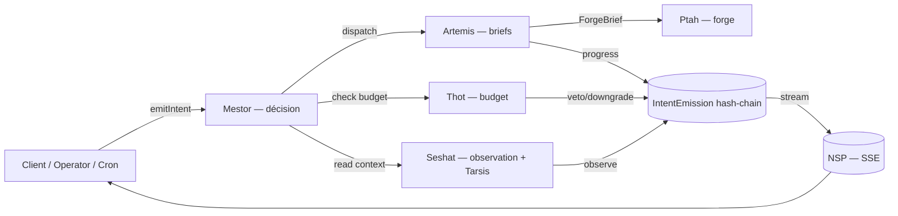

# La Fusée — Industry OS

**L'Industry OS du marché créatif africain.** Construit par l'agence **UPgraders**.

> **Mission (north star)** : transformer des marques en icônes culturelles, en
> industrialisant l'accumulation de superfans qui font basculer la fenêtre
> d'Overton dans leur secteur. Tout le reste — Neteru, Oracle, Glory tools,
> ADVERTIS, APOGEE, les 4 portails — n'existe que pour servir cette mécanique.
> Voir [docs/governance/MISSION.md](docs/governance/MISSION.md).

> Un brief client arrive en PDF. Le rapport diagnostic web tombe en 15 minutes.
> 48h plus tard, la stratégie est écrite, les missions sont en production, et
> les freelances livrent.

---

## Quick start

> **Prérequis** : Node.js ≥ 22 (testé v22.14), PostgreSQL ≥ 14, npm.

```bash
# 1. Clone + install
git clone https://github.com/xtincell/ADVE-project.git
cd ADVE-project
npm install

# 2. Environnement — copier le template et remplir le bloc REQUIS
cp .env.example .env.local
#   → DATABASE_URL, NEXTAUTH_SECRET (openssl rand -base64 32), ANTHROPIC_API_KEY
#   Le reste est optionnel (ship-without-keys, ADR-0021/0079).

# 3. Créer la base (ignorer si la DB de DATABASE_URL existe déjà)
createdb lafusee            # ou : psql -c 'CREATE DATABASE lafusee;'

# 4. Générer le client Prisma + appliquer les migrations sur une DB vide
npm run db:generate
npx prisma migrate deploy   # applique les 37 migrations dans l'ordre

# 5. (Optionnel) seed des données de référence + démo
npm run db:seed             # seed de base
# npm run db:seed:all       # base + pays + démo + spawt + wakanda

# 6. Lancer
npm run dev                 # → http://localhost:3000
```

**Build production :** `npm run build && npm start`

> Sur un **clone neuf**, utilise `prisma migrate deploy` (applique les migrations
> existantes, n'en génère jamais). Réserve `npm run db:migrate` (`prisma migrate
> dev`) à l'**authoring** de changements de schéma.

### Variables d'environnement

**Requises** : `DATABASE_URL`, `NEXTAUTH_SECRET`, `ANTHROPIC_API_KEY` (+ `NEXTAUTH_URL`/`AUTH_URL` en local = `http://localhost:3000`).

**Optionnelles** (toutes ship-without-keys) : `OPENAI_API_KEY` / `OLLAMA_BASE_URL` (fallbacks LLM), paiements (`STRIPE_*` / `PAYPAL_*` / `CINETPAY_*`), mobile money (`WAVE_*` / `ORANGE_MONEY_*` / `MTN_MOMO_*`), email (`RESEND_API_KEY` / `SENDGRID_API_KEY`), Ptah forge (`FREEPIK_API_KEY` / `ADOBE_FIREFLY_*` / `FIGMA_PAT` / `CANVA_*`), connecteurs (`ZOHO_*` / `MONDAY_*` / `SESHAT_API_URL`), `CRON_SECRET`, `INTEGRATION_TOKEN_KEY`. Liste complète + commentaires : [`.env.example`](.env.example).

---

## ✅ État vérifié (2026-06-16)

Vérifié sur la machine mainteneur avant publication :

| Check | Commande | Résultat |
|---|---|---|
| Build production | `npm run build` | ✅ exit 0 (route table complète) |
| Type check | `npx tsc --noEmit` | ✅ clean |
| Lint | `npm run lint` | ✅ clean (warnings advisory pré-existants seulement) |
| Schéma Prisma | `npx prisma validate` | ✅ valid |
| Migrations | `git ls-files prisma/migrations` | ✅ 37 migrations versionnées |
| Client Prisma | `npm run db:generate` | ✅ généré (v7.8.0) |
| Suite anti-drift gouvernance | `npx vitest run tests/unit/governance` | ✅ 805 passed |
| Suite complète | `npx vitest run` | ✅ 2069 passed |

---

## Le problème

Aucune structure de classe mondiale ne sert correctement le marché créatif en
Afrique francophone. Les groupes internationaux maintiennent des boîtes aux
lettres ; leurs méthodologies restent à Paris ou Londres. Les agences locales
ont du talent mais rien de codifié, reproductible ou mesurable. Chaque projet
est un artisanat — c'est ce qui empêche le marché de scaler.

## La solution

La Fusée **industrialise** la chaîne de valeur créative — du brief au livrable,
du diagnostic au paiement :

- **Un brief entre** → l'OS le scanne, identifie la marque, diagnostique ses 8
  piliers ADVE-RTIS, génère la stratégie, dispatche les missions.
- **Un opérateur supervise** → il pilote, ne produit plus. L'IA propose,
  l'humain valide. Chaque décision est tracée à vie (hash-chain), chaque
  livrable scoré, chaque franc gouverné par Thot.
- **Les marques montent en puissance** → trajectoire **APOGEE** en 6 paliers
  (`LATENT → FRAGILE → ORDINAIRE → FORTE → CULTE → ICONE`).
- **Les créatifs sont structurés** → tier system, matching automatique, QC,
  paiement mobile money.

---

## Stack

- **Next.js 16** (App Router, Turbopack) · **React 19** · **TypeScript 6**
- **tRPC 11** · **Prisma 7** (PostgreSQL, driver-adapter) · **NextAuth v5**
- **Tailwind 4** + design system CVA — **UPgraders DS** (ADR-0097 : corail `#E56458` + or `#FACC15`, Clash Display + Satoshi)
- **LLM Gateway v4** multi-vendor (Anthropic → OpenAI → Ollama, circuit breaker, cost tracking)
- **Vitest 4** (unit/anti-drift) · **Playwright 1.59** (e2e/a11y/visual)
- ESLint 10 + `madge` enforcent la cascade de layering :
  `domain → lib → server/governance → server/services → server/trpc → components → app`

---

## Gouvernance — le Panthéon NETERU (7/7)

L'OS est gouverné par **7 Neteru actifs** (cap APOGEE atteint). Source de vérité : [docs/governance/PANTHEON.md](docs/governance/PANTHEON.md).



| Neter | Rôle | Loi |
|---|---|---|
| **Mestor** | Guidance — décision. Point d'entrée unique de toute mutation (`mestor.emitIntent`). | LOI 1 — chaque mutation traverse Mestor. |
| **Artemis** | Propulsion (brief) — Glory tools rédactionnels. Livrable phare : l'**Oracle** (35 sections). | LOI 2 — Artemis produit, ne décide pas. |
| **Ptah** | Propulsion (forge) — matérialise les briefs via Magnific / Adobe Firefly / Figma / Canva. | LOI 2bis — Ptah forge ce qu'Artemis prescrit. |
| **Seshat** | Telemetry — observation + Tarsis (signaux faibles) + Overton. Read-only. | LOI 3 — Seshat n'écrit jamais sur la marque. |
| **Thot** | Sustainment — cerveau financier, cost-gate, fuel. | LOI 4 — pas de combustion sans propellant. |
| **Imhotep** | Crew — matching talent + Académie + QC. | LOI 5 — Imhotep apparie, ne forge pas. |
| **Anubis** | Comms — broadcast multi-canal + ad networks + email/SMS + Credentials Vault. | LOI 6 — Anubis diffuse ce que Ptah a forgé. |

Toute mutation crée une ligne `IntentEmission` hash-chainée (tampering détectable). Outils transverses : **Notoria** (reco scorée), **Jehuty** (feed intelligence), **Pillar Gateway** (écriture pilier versionnée).

---

## ADVE-RTIS — la cascade qui propulse

8 piliers, scoring sur 200, cascade unidirectionnelle `A → D → V → E → R → T → I → S` :

| | Pilier | Mesure | | Pilier | Mesure |
|---|---|---|---|---|---|
| **A** | Authenticité | l'ADN | **R** | Risque | vulnérabilités |
| **D** | Distinction | l'unicité | **T** | Track | réalité marché |
| **V** | Valeur | apport client | **I** | Innovation | potentiel |
| **E** | Engagement | fans, pas clients | **S** | Stratégie | le plan |

**ADVE** = socle fondateur (édité par l'opérateur via `OPERATOR_AMEND_PILLAR`). **RTIS** = dérivé (jamais édité à la main). Voir [docs/governance/APOGEE.md](docs/governance/APOGEE.md) pour les Trois Lois de Trajectoire.

---

## Les 5 portails (+ Intake public)

| Portail | Pour qui | Ce qu'il fait |
|---|---|---|
| **Console** | UPgraders | Pilote l'industrie — clients, diagnostics, missions, talents, gouvernance |
| **Cockpit** | Founder | Voit son score, ses piliers, ses livrables, son axe Overton sectoriel |
| **Creator** | Freelance | Missions disponibles, claim, livraison, montée en tier |
| **Agency** | Agence partenaire | Clients, missions, revenus, contrats |
| **La Guilde** | Public · crew | Marketplace public (ADR-0098) — mur des missions, dépôt de brief marque, inscription freelance/agence, candidatures (façade publique d'Imhotep) |
| **Intake** | Prospect public | Remplit un formulaire ; l'IA fait le reste |

---

## Project layout

```
src/
  domain/        # Layer 0 — types purs (pillars, ConnectorResult…), zod-only
  lib/           # Layer 1 — db client (Prisma 7 adapter), utils, design helpers
  server/
    governance/  # manifests, intent kinds, SLOs, pillar readiness, hash-chain
    services/    # 7 Neteru + sous-systèmes (mestor, artemis, seshat, thot, ptah, imhotep, anubis…)
    trpc/        # routers (Layer 6)
  components/    # primitives (DS) → neteru kit → portal-specific (Layer 7)
  app/           # routes par portail : (console) (cockpit) (agency) (creator) + intake public
prisma/          # schema.prisma + migrations/ + seed.ts + prisma.config.ts
docs/governance/ # ADRs, MISSION, APOGEE, PANTHEON, LEXICON, *-MAP.md
_bmad-output/    # artefacts planning + implementation (PRD/UX/architecture/epics)
```

**À lire en premier si tu contribues** : [`CLAUDE.md`](CLAUDE.md) (briefing projet + phase status) puis [`docs/governance/MISSION.md`](docs/governance/MISSION.md). Les décisions d'archi sont des ADRs dans [`docs/governance/adr/`](docs/governance/adr/).

---

## Testing

```bash
npm test                                # vitest (watch)
npx vitest run tests/unit/governance    # suite anti-drift / gouvernance
npm run test:e2e                        # Playwright e2e (app en cours d'exécution requise)
npm run audit:cycles                    # madge --circular (garde-fou layering)
```

---

## Troubleshooting

**`P3009: migrate found failed migrations`** — ta DB **locale** a une migration marquée en échec (souvent en mixant `prisma db push` et `migrate`, ou un apply partiel). Les fichiers de migration du repo sont sains ; c'est un état de DB local. Fix le plus rapide pour une DB de dev (⚠️ détruit les données locales) :

```bash
npx prisma migrate reset      # drop, ré-applique toutes les migrations, re-seed
```

Pour préserver les données (seulement si l'échec était propre, pas un apply partiel) :

```bash
npx prisma migrate resolve --rolled-back <nom_migration>
npx prisma migrate deploy
```

**`DATABASE_URL is not set`** — Prisma 7 lit l'URL au runtime via le driver adapter ([`src/lib/db.ts`](src/lib/db.ts)). Vérifie que `.env.local` existe et contient `DATABASE_URL`.

**Les flows LLM échouent mais l'app charge** — attendu sans `ANTHROPIC_API_KEY`. L'app boote, l'intake ADVE marche ; les étapes génératives (Oracle, briefs) ont besoin d'une clé LLM.

**Connecteurs en "attente d'activation" / DEFERRED** — attendu : paiements, mobile money, email, Tarsis, CRM, providers Ptah sont tous ship-without-keys. Configure-les dans le Credentials Vault (Console) ou via `.env.local`.

---

## Statut

**v6.27.x (juin 2026)** — Phase 23 (mécaniques pivot superfans × Overton) close de bout en bout. Depuis : mégasprint back-end « galileo » (V1→V14) — scoring déterministe, Oracle 35/35 sans LLM, paiements production deux-rails (Stripe + mobile money, ADR-0092), Thot coûts atomisés par marché (ADR-0093), **La Guilde** portail public marketplace crew (ADR-0098), **Argos by LaFusée** déployable (ADR-0100), **UPgraders DS** canon (ADR-0097), base Supabase branchée. Cap APOGEE 7/7 préservé. Historique complet : [`CHANGELOG.md`](CHANGELOG.md). Ledger de complétion fonctionnelle : [`_bmad-output/planning-artifacts/closure-roadmap.md`](_bmad-output/planning-artifacts/closure-roadmap.md).

Versionnage : **`MAJEURE.PHASE.ITERATION`** (voir [CHANGELOG.md](CHANGELOG.md)).

---

## Licence

Proprietary — UPgraders / La Fusée. Tous droits réservés.
