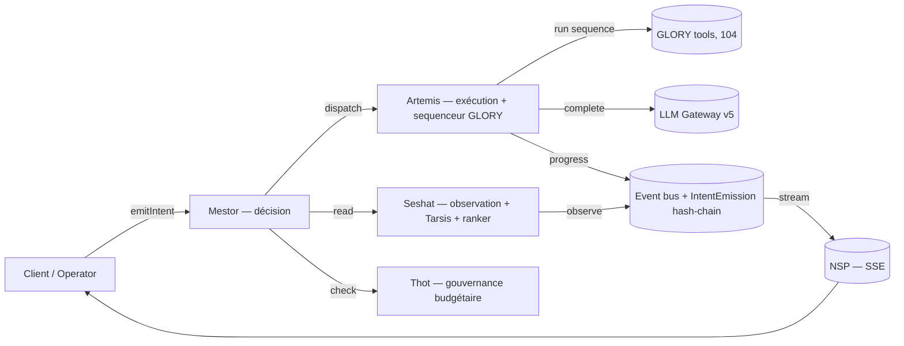

# La Fusée `v5.4`

**L'Industry OS du marché créatif africain.** Construit par l'agence **UPgraders**.

> Refonte gouvernance « sans compromis » en cours — voir
> [docs/governance/REFONTE-PLAN.md](docs/governance/REFONTE-PLAN.md) pour
> l'état des Phases 0 → 8 et les contrats qui régissent toute nouvelle
> fonction (manifest + Intent kind + test).

> Un brief client arrive en PDF. 48h plus tard, la marque est diagnostiquee, la strategie est ecrite, les missions sont en production, et les freelances livrent.

---

## Le probleme

Aucune structure de classe mondiale ne sert correctement le marche creatif en Afrique francophone.

Les groupes internationaux (Havas, Publicis, WPP) maintiennent des bureaux a Abidjan, Douala, Dakar — des boites aux lettres. Leurs methodologies restent a Paris ou Londres. Le client africain recoit un service de tier 3 au prix du tier 1.

Les agences locales ont du talent, de l'intuition, de la debrouillardise. Mais rien de codifie, rien de reproductible, rien de mesurable. Chaque projet est un artisanat. C'est ce qui empeche le marche de scaler.

Le freelance creatif recoit des briefs vagues, est paye au lance-pierres, n'a aucune visibilite sur sa prochaine mission. Le DA porte la vision creative de 8 clients sans methode formalisee. Le chef de marque jongle entre prestataires qui ne se parlent pas.

## La solution

La Fusee **industrialise** la chaine de valeur creative — du brief au livrable, du diagnostic au paiement :

**Un brief entre** → le systeme le scanne, identifie la marque, diagnostique ses forces et faiblesses sur 8 piliers, genere la strategie, cree les missions par livrable, et les dispatche aux bons talents.

**Un operateur supervise** → il ne produit plus, il pilote. L'IA propose, l'humain valide. Chaque decision est tracee, chaque livrable est score, chaque franc depense est justifie.

**Les marques montent en puissance** → de CRITICAL a LEGENDARY, chaque marque a un score sur 200 qui evolue en temps reel. Le client voit son dashboard, comprend ou il en est, et sait exactement ce que son budget produit.

**Les creatifs sont structures** → tier system, matching automatique, QC, paiement. Un freelance a Douala peut livrer un KV pour une marque a Abidjan sans qu'un humain ait fait le dispatch.

---

## Comment ca marche

### 1. Le brief arrive

Un client envoie un PDF. Le systeme extrait tout : marque, contexte, objectifs, cibles, livrables, budget. L'operateur review et confirme en un clic.

### 2. La marque est diagnostiquee

Le **NETERU** — le trio divin qui propulse La Fusee — prend le relais :

- **Mestor** decide et conseille. C'est le LLM maitre de La Fusee — il tranche, il recommande, il planifie.
- **Artemis** orchestre et produit. Elle enchaine ses outils GLORY en sequences combinatoires — comme des combos de jeux video — pour produire les livrables. Son livrable phare : **l'Oracle**, le one-shot de conseil de marque au standard industriel maximal, concu pour convertir en retainer.
- **Seshat** connait et prevoit le futur. C'est le LLM qui interprete les donnees que son curateur **Tarsis** lui fournit — signaux faibles, articles de presse, tendances sectorielles — pour anticiper ce que le marche fera demain.

En 24 frameworks diagnostiques, la marque est radiographiee sur 8 piliers :

| | Pilier | Ce qu'on mesure |
|---|---|---|
| **A** | Authenticite | L'ADN. Qui est cette marque, vraiment ? |
| **D** | Distinction | Ce qui la rend unique face a la concurrence |
| **V** | Valeur | Ce qu'elle apporte concretement au client |
| **E** | Engagement | Sa capacite a creer des fans, pas juste des clients |
| **R** | Risque | Ses vulnerabilites et comment les couvrir |
| **T** | Track | La realite du marche — chiffres, pas opinions |
| **I** | Innovation | Son potentiel inexploite |
| **S** | Strategie | Le plan pour passer de ou elle est a ou elle veut aller |

Score total sur 200. De CRITICAL (< 50) a LEGENDARY (170+).

### 3. La strategie s'ecrit toute seule

91 outils AI specialises — les **Glory Tools** — produisent les livrables : manifeste de marque, brandbook, offre, plan media, direction artistique, scripts TV/radio, KV affichage, plan annuel...

Organises en 31 sequences avec un **skill tree** : les fondations doivent etre posees avant de lancer la production. Pas de KV sans brandbook. Pas de campagne 360 sans strategie.

### 4. Les missions partent en production

Chaque livrable du brief devient une **mission** sur le wall. Les freelances et agences voient les missions disponibles, triees par match avec leur profil. Ils claim, ils livrent, c'est QC, c'est paye.

### 5. Tout est mesure

Chaque franc, chaque heure, chaque livrable, chaque score — tout est trace. Le client voit son cockpit. L'operateur voit sa console. Le createur voit sa progression.

---

## Qui utilise quoi

| Portail | Pour qui | Ce qu'il fait |
|---|---|---|
| **Console** | L'operateur (fixer) | Pilote toute l'industrie — clients, diagnostics, campagnes, missions, talents, revenus |
| **Cockpit** | Le client (marque) | Voit son score, ses piliers, ses livrables, sa strategie. Pas de jargon, que du concret |
| **Creator** | Le freelance/talent | Voit les missions dispo, claim, livre, est evalue, monte en tier |
| **Agency** | L'agence partenaire | Gere ses clients, missions, revenus, contrats via le systeme |
| **Intake** | Le prospect | Remplit un formulaire. L'IA fait le reste |

---

## Ce qui tourne sous le capot

### Architecture NETERU — Quartet (Mestor / Artemis / Seshat / Thot)



L'**Oracle** (livrable phare, 21 sections, 5 phases) est *un output* de
cette chaîne, pas un service à part. Il est typé et versionné via
`OracleSnapshot` → time-travel possible (Phase 7).

- **Mestor** — décision. Point d'entrée unique pour toute mutation
  métier (`mestor.emitIntent`). Persiste chaque intent dans
  `IntentEmission` (hash-chain Phase 3, tampering détectable).
- **Artemis** — exécution. Lance les frameworks et **le sequenceur**, qui
  est lui-même un outil d'Artemis et **consomme** les 104 GLORY tools
  atomiques. Manifeste : `EXECUTE_GLORY_SEQUENCE` est routé vers
  Artemis ; les outils atomiques sont accessibles via `INVOKE_GLORY_TOOL`
  (handler = service `glory-tools`).
- **Seshat** — observation + Tarsis (signaux faibles) + ranker
  cross-brand. Read-only. Échec silencieux par contrat (jamais bloquant).
- **Thot** — cerveau financier. Veto / downgrade / record cost. Entité
  séparée du trio. SLOs cost-p95 par Intent kind dans
  [`src/server/governance/slos.ts`](src/server/governance/slos.ts).
- **Notoria** — Le moteur de recommandation. Outil partage, Mestor est le lead. Genere des recos granulaires (SET/ADD/MODIFY/REMOVE/EXTEND) avec editorial Mestor (advantages, disadvantages, urgency). Pipeline ADVERTIS: ADVE → I → S avec gates de review. Bible de format injectee dans tous les prompts LLM.
- **Jehuty** — L'organe de presse de Seshat. Feed d'intelligence strategique qui agrege signaux marche + recos Notoria + diagnostics Artemis. Curation: pin, dismiss, trigger-Notoria. Dual-mode: cockpit (par marque) + console (multi-marques).
- **Pillar Gateway** — LOI 1 du systeme : toute ecriture sur un pilier passe par ce gateway. Versioning immutable, audit trail, confidence tracking. Verrou Bible integre.

### Les 9 divisions de la Console

| Division | Couleur | Ce qu'elle gere |
|---|---|---|
| **L'Oracle** | Or | Clients, diagnostics, ingestion de briefs, boot sequence |
| **Mestor** | Violet profond | Plans d'orchestration, recommandations, insights |
| **Artemis** | Emeraude | Missions, campagnes, Glory tools, Skill Tree, Vault |
| **Seshat** | Bleu | Intelligence marche, signaux, knowledge, Tarsis |
| **L'Arene** | Orange | Guilde de creatifs, matching, organisations |
| **Le Socle** | Vert | Revenus, commissions, contrats, facturation |
| **L'Academie** | Jaune | Formations, certifications, boutique |
| **Config** | Gris | Parametres systeme, bible des variables |
| **Ecosysteme** | — | Operateurs, metriques globales |

### Stack technique

| Composant | Technologie |
|---|---|
| Framework | Next.js 15, App Router, Turbopack |
| Language | TypeScript 5.8 strict |
| API | tRPC v11 + React Query v5 |
| Database | PostgreSQL via Prisma 6 (2600 lignes de schema) |
| Auth | NextAuth v5 (RBAC : FIXER, ASSOCIE, CLIENT, CREATOR, AGENCY) |
| AI | Anthropic Claude (primaire) + OpenAI/Ollama (fallback) — LLM Gateway multi-vendor |
| Agents | Model Context Protocol (9 serveurs MCP dont 1 inbound) |
| UI | Tailwind CSS 4, Lucide Icons, Recharts |
| Tests | Vitest (unit) + Playwright (e2e) |
| Deploy | Vercel (crons integres) |

### Services principaux

| Service | Ce qu'il fait |
|---|---|
| **Brief Ingest** | PDF → ParsedBrief → pipeline NETERU complet |
| **Ingestion Pipeline** | Documents marque → remplissage ADVE par IA |
| **RTIS Protocols** | Cascade Risk → Track → Innovation → Strategy |
| **Campaign Manager 360** | State machine campagne, gates, budget, AARRR |
| **Matching Engine** | Score talent ↔ mission, suggestion top 3 |
| **Sequence Vault** | Staging → review operateur → promotion en asset marque |
| **AdvertisVector Scorer** | Score /200, snapshots, historique, classification |
| **LLM Gateway** | Multi-vendor (Anthropic/OpenAI/Ollama), circuit breaker, budget governance, caller tags |
| **Advertis Inbound** | Ingestion signaux SaaS clients (Monday, Zoho) → piliers ADVE via Pillar Gateway |
| **Prompt Registry** | Versioning des 104 prompts Glory Tools avec rollback |
| **Board Export** | Deck 6 slides (Score, ADVE, Recos, Progress, ROI FCFA, Next steps) |
| **Financial Engine** | Unit economics, budget allocator, P&L |

### Outils NETERU partages

| Outil | Role | Gouverneur |
|---|---|---|
| **Notoria** | Moteur de recommandation — genere, valide, applique des recos sur les fiches ADVERTIS | Mestor (lead) |
| **Jehuty** | Feed d'intelligence strategique — organe de presse de Seshat, Bloomberg Terminal de la marque | Seshat |
| **Thot** | Cerveau financier — validation budgets/prix, benchmarks sectoriels, 40+ regles | Artemis |

### Bible des Variables

134 variables ADVERTIS documentees avec format de fond (description, regles, min/max, exemples).
Verrou central : `validateAgainstBible()` execute a chaque ecriture dans le Pillar Gateway.
Les violations BLOCK sont revertes pour les systemes IA (les operateurs bypass).

### Chiffres

| Metrique | Valeur |
|---|---|
| Pages/routes | 164 |
| Fichiers TypeScript | 559 |
| Lignes de code | 120,000+ |
| Routers tRPC | 68 |
| Modeles Prisma | 116 |
| Serveurs MCP | 9 (8 outbound + 1 inbound) |
| Services backend | 72 |
| Glory Tools | 104 |
| Sequences | 31 |
| Frameworks diagnostiques | 24 |
| REQs CdC implementes | 280/280 (100%) |

---

## Demarrage rapide

```bash
git clone https://github.com/xtincell/ADVE-project.git
cd ADVE-project
npm install
cp .env.example .env   # Remplir DATABASE_URL, ANTHROPIC_API_KEY, NEXTAUTH_SECRET
npx prisma migrate dev
npm run dev             # → http://localhost:3000
```

### Prerequisites

- Node.js 20+
- PostgreSQL 15+
- Cle API Anthropic

### Scripts

| Script | Description |
|---|---|
| `npm run dev` | Dev server (Turbopack) |
| `npm run build` | Build production |
| `npm run test` | Tests unitaires (Vitest) |
| `npm run test:e2e` | Tests E2E (Playwright) |
| `npm run db:push` | Push schema Prisma |
| `npm run db:migrate` | Migration dev |

---

## Structure du projet

```
src/
├── app/
│   ├── (console)/           # Console operateur — 60+ pages, 9 divisions
│   ├── (cockpit)/           # Cockpit client — dashboard marque
│   ├── (creator)/           # Portail createur — missions, QC, gains
│   ├── (agency)/            # Portail agence — clients, revenus
│   ├── (intake)/            # Widget intake public (4 methodes)
│   ├── (auth)/              # Login, register, reset
│   └── api/                 # tRPC, MCP, crons, export, webhooks
├── components/              # 35+ composants partages
├── lib/                     # Types, schemas Zod, client tRPC
└── server/
    ├── services/            # 66 services (mestor, artemis, seshat, notoria, jehuty, ...)
    ├── mcp/                 # 9 serveurs MCP (creative, intelligence, operations, pulse, seshat, artemis, guild, notoria, advertis-inbound)
    └── trpc/                # 69 routers
```

---

## Documentation

| Document | Contenu |
|---|---|
| [CHANGELOG.md](./CHANGELOG.md) | Historique des versions (v1.0 → v3.3) |
| `Documentation/ANNEXE-A-METHODOLOGIE-ADVE.md` | Methodologie ADVE-RTIS |
| `Documentation/ANNEXE-B-GLORY-TOOLS.md` | 91 Glory Tools |
| `Documentation/ANNEXE-C-CAMPAIGN-MANAGER-360.md` | Campaign Manager, missions, SLA |
| `Documentation/CDC-V5.md` | Cahier de charges v5 — architecture NETERU |

---

## Versionnage

Format : **`MAJEURE.PHASE.ITERATION`** — voir [CHANGELOG.md](./CHANGELOG.md)

| Version | Date | Jalon |
|---|---|---|
| **v4.0.0-alpha** | 2026-04-13 | Advertis Inbound, LLM governance, multi-tenant RLS, cultural variants |
| v3.4.0 | 2026-04-12 | Notoria + Jehuty + Thot + Gouvernance NETERU + Bible verrou + 100% CdC |
| v3.3.0 | 2026-04-10 | Brief Ingest Pipeline NETERU-governed |
| v3.2.0 | 2026-04-08 | Artemis Context System + Vault |
| v3.1.0 | 2026-04-04 | Architecture NETERU |
| v3.0.0 | 2026-03-31 | Bible ADVERTIS 134 variables |
| v2.5.0 | 2026-03-25 | Glory 91 tools, 31 sequences |
| v2.0.0 | 2026-02-20 | 3 portails operationnels |
| v1.0.0 | 2026-01-25 | Foundation |

---

## v4.0.0-alpha — Notes de mise a jour

> **Ce que v4 change** : La Fusee passe de 8 serveurs MCP *outbound* (le systeme parle au monde) a un Industry OS *bidirectionnel* — capable d'ingerer automatiquement les signaux des outils SaaS que le client utilise deja (Monday, Zoho, etc.) pour nourrir les piliers ADVE sans ressaisie.

### Ce qui est nouveau

**Advertis Inbound — le 9e serveur MCP (premier inbound)**

Le probleme v3 : un client qui utilise Monday pour ses projets et Zoho pour son CRM devait re-saisir toute l'info dans l'intake. V4 connecte ses outils directement aux piliers ADVE :

| Connecteur | Evenement | Pilier | Driver |
|---|---|---|---|
| Monday.com | Tache terminee | **E** (Engagement) | velocity |
| Monday.com | Timeline en retard | **R** (Risk) | blocker |
| Monday.com | WIP count | **S** (Strategy) | wip |
| Zoho CRM | Deal avance | **V** (Valeur) | pipeline |
| Zoho CRM | Deal gagne | **T** (Track) | conversion |
| Zoho CRM | Deal perdu | **R** (Risk) | loss |

Chaque signal passe par le Pillar Gateway existant (validation, versioning, audit trail, scoring). Le protocole Track (RTIS) charge automatiquement les signaux externes et booste la confidence de +10% quand des donnees SaaS sont presentes.

**Type canonique PillarSignal**

Nouveau contrat (`src/lib/types/pillar-signal.ts`) que tout producteur de signaux doit respecter : `pillarKey`, `driver`, `value`, `source`, `confidence`. Cinq sources definies : OPERATOR, RTIS, EXTERNAL_SAAS, FEEDBACK, METRIC. Chaque source a un plancher de confidence.

**Gouvernance budget LLM**

91+ Glory Tools x appels Claude x par marque = facture potentiellement non-maitrisee. V4 ajoute un cap mensuel par strategie (`llmBudget` en USD) avec :
- Auto-downgrade du modele (Opus → Sonnet → Haiku) a l'approche du plafond
- Alertes a 75%, 90%, 100%
- 1 appel Haiku de grace au-dela du cap

Le hook est dans le LLM Gateway — chaque `callLLM()` verifie le budget avant d'appeler.

**Auto-approbation Pillar Gateway**

Le goulot fixer (defaut #3 de l'audit v3) est attenue : quand un protocole RTIS ecrit avec confidence > 0.9 et impact faible, le Pillar Gateway auto-promeut `AI_PROPOSED` → `VALIDATED` avec fenetre de rollback de 24h. L'operateur reste informe mais n'est plus bloquant pour les decisions a haute certitude.

**Registre de prompts versiones**

Les 104 prompts Glory Tools sont migres depuis le code dur vers une table `PromptVersion` avec versioning semantique. Chaque `GloryOutput` enregistre quelle version du prompt l'a produit. Rollback possible sans deploiement.

**Multi-tenant Row-Level Security**

Colonne `tenantId` ajoutee sur 8 models critiques (Strategy, Campaign, Mission, Signal, Driver, Pillar, GloryOutput, KnowledgeEntry). Filet de securite via AsyncLocalStorage en plus de l'operator-isolation existant. Script de backfill inclus.

**Boucle feedback → RAG**

Les diagnostics ARTEMIS valides sont maintenant stockes comme `FEEDBACK_VALIDATED` dans le Knowledge Graph, puis injectes dans le system prompt de Mestor et le contexte des Glory Tools. Le systeme apprend de ses drifts passes au lieu de repartir a zero a chaque brief.

**Framework de variantes culturelles**

4 registres sociolinguistiques pour les contenus consumer-facing :
- `formal_fr` — francais business standard (tous marches)
- `nouchi_ci` — registre urbain ivoirien (Abidjan)
- `camfranglais_cm` — melange FR/EN/pidgin camerounais (Douala/Yaounde)
- `wolof_sn` — bilingue wolof-francais (Dakar)

Chaque registre inclut des `termMappings` et `toneGuidelines` injectes dans les prompts de traduction.

**Export board-ready**

Deck JSON 6 slides pour presentation au board (CEO/CFO) : Score overview, ADVE breakdown, Top 5 recos, Progress operations, ROI en FCFA, Next steps. Bilingue FR/EN.

**LLM multi-vendor avec failover**

Le LLM Gateway passe de 100% Anthropic a un systeme de fallback : Anthropic (primaire) → OpenAI (fallback) → Ollama (offline). Circuit breaker par provider (3 echecs → ouvert 30s, auto-reset).

### Schema Prisma — nouveaux models

| Model | Role |
|---|---|
| `PromptVersion` | Prompt versione par Glory Tool (slug, version, template, isActive) |
| `ExternalConnector` | Connecteur SaaS inbound (Monday, Zoho) avec stats sync et circuit breaker |

### Schema Prisma — champs ajoutes

| Model | Champ | Type |
|---|---|---|
| Strategy | `llmBudget` | Float? — cap mensuel USD |
| Strategy | `llmBudgetAlerts` | Json? — seuils 75/90/100% |
| GloryOutput | `promptVersion` | Int? — version du prompt utilise |
| Operator | `dataRegion` | String — region de residence des donnees |
| 8 models | `tenantId` | String? — isolation multi-tenant |

### Scripts v4

```bash
npx prisma db push                              # Creer les tables
npx tsx prisma/seed.ts                           # Seed de base (CIMENCAM)
npx tsx scripts/seed-wakanda/index.ts            # Seed Wakanda (6 marques, 844 records)
npx tsx scripts/seed-prompt-versions.ts          # Migrer les 104 prompts vers le registre
npx tsx scripts/backfill-tenant-id.ts            # Backfill tenantId depuis operatorId
```

### Ce qui reste a faire (post-alpha)

- [ ] OAuth reel pour Monday.com et Zoho CRM (callbacks + token refresh)
- [ ] Prisma `$extends()` pour le RLS middleware (remplace le stub actuel)
- [ ] Connecteurs supplementaires : Slack, Power BI, Wave.app, HubSpot
- [ ] Board export en PDF (actuellement JSON, le rendu PDF est cote client)
- [ ] Mise a jour du seed Wakanda avec les champs v4 (tenantId, ExternalConnector demo)
- [ ] Data residency : routing multi-region (Azure Francophone Africa, AWS Cape Town)

---

## Licence

Proprietary — LaFusee SARL. Tous droits reserves.
