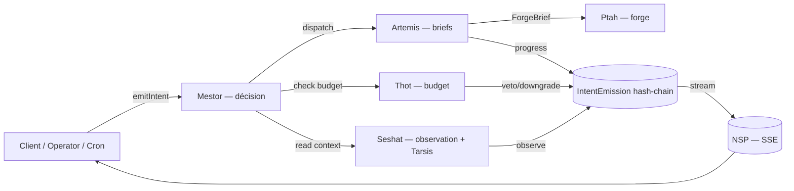

# La Fusée — Industry OS

**L'Industry OS du marché créatif africain.** Construit par l'agence **UPgraders**.

> **Mission (north star)** : transformer des marques en icônes culturelles, en
> industrialisant l'accumulation de superfans qui font basculer la fenêtre
> d'Overton dans leur secteur. Tout le reste — Neteru, Oracle, Glory tools,
> ADVERTIS, APOGEE, les 4 portails — n'existe que pour servir cette mécanique.
> Voir [docs/governance/MISSION.md](docs/governance/MISSION.md).

> Un brief client arrive en PDF. Le rapport diagnostic web tombe en 15 minutes.
> 48h plus tard, la stratégie est écrite, les missions sont en production, et
> les freelances livrent.

---

## Quick start

> **Prérequis** : Node.js ≥ 22 (testé v22.14), PostgreSQL ≥ 14, npm.

```bash
# 1. Clone + install
git clone https://github.com/xtincell/ADVE-project.git
cd ADVE-project
npm install

# 2. Environnement — copier le template et remplir le bloc REQUIS
cp .env.example .env.local
#   → DATABASE_URL, NEXTAUTH_SECRET (openssl rand -base64 32), ANTHROPIC_API_KEY
#   Le reste est optionnel (ship-without-keys, ADR-0021/0079).

# 3. Créer la base (ignorer si la DB de DATABASE_URL existe déjà)
createdb lafusee            # ou : psql -c 'CREATE DATABASE lafusee;'

# 4. Générer le client Prisma + appliquer les migrations sur une DB vide
npm run db:generate
npx prisma migrate deploy   # applique les migrations versionnées dans l'ordre

# 5. (Optionnel) seed des données de référence + démo
npm run db:seed             # seed de base
# npm run db:seed:calibration  # région Wakanda (calibration : marques + prestataires + briefs + actions)
# npm run db:seed:all          # base + pays + coûts + démo + spawt + wakanda

# 6. Lancer
npm run dev                 # → http://localhost:3000
```

**Build production :** `npm run build && npm start`

> **Déploiement** : Vercel (cible canonique, auto-deploy) **et/ou** self-host
> « serverfull » sur machine dédiée (serveur Node persistant → pas de timeout
> serverless sur les flux LLM longs ; option Ollama GPU local). Runbook complet :
> [docs/deploy/SELF-HOST.md](docs/deploy/SELF-HOST.md).

> Sur un **clone neuf**, utilise `prisma migrate deploy` (applique les migrations
> existantes, n'en génère jamais). Réserve `npm run db:migrate` (`prisma migrate
> dev`) à l'**authoring** de changements de schéma.

### Variables d'environnement

**Requises** : `DATABASE_URL`, `NEXTAUTH_SECRET`, `ANTHROPIC_API_KEY` (+ `NEXTAUTH_URL`/`AUTH_URL` en local = `http://localhost:3000`).

**Optionnelles** (toutes ship-without-keys) : `OPENAI_API_KEY` / `OLLAMA_BASE_URL` / `OPENROUTER_API_KEY` (fallbacks LLM en cascade), `MANUAL_PAYMENT_WHATSAPP_NUMBER` (paiement manuel WhatsApp), paiements (`STRIPE_*` / `PAYPAL_*` / `CINETPAY_*`), mobile money (`WAVE_*` / `ORANGE_MONEY_*` / `MTN_MOMO_*`), email (`RESEND_API_KEY` / `SENDGRID_API_KEY`), Ptah forge (`FREEPIK_API_KEY` / `ADOBE_FIREFLY_*` / `FIGMA_PAT` / `CANVA_*`), connecteurs (`ZOHO_*` / `MONDAY_*` / `SESHAT_API_URL`), `CRON_SECRET`, `INTEGRATION_TOKEN_KEY`. Liste complète + commentaires : [`.env.example`](.env.example).

---

## État courant borné — 2026-10-09

**Candidat 6.27.435, lecture ADMIN du dossier choisi** : listForges seulement
utilise le rôle effectif canonique et le dossier explicitement sélectionné,
sans équipe par défaut. Lecture seule sans reprise si affectation absente ;
mutations/autres lectures restent strictes, aucun droit/équipe/rôle nouveau.
Deux rouges/49 verts puis 51 PG ciblés verts. Native locale par URL connue sur
deux dossiers de deux équipes : chacun sa tâche, canResume=false, lecture seule,
sans bouton ni secret. Actualiser HTTP 200/zéro exception, fenêtre complète ;
copie FR finale relue, fixture nettoyée/serveur arrêté. Sélecteur 0/0 non reçu,
reload tronqué sans SLO. Gauntlet 435 cinq exit 0, gouvernance 1620/166/24 warnings
préexistants ; PG complet seul après arrêt Next 274/14 en 41,09 s, Ptah 51 inclus.
Suite globale 435 non répétée localement, 4180/399 historique 434 ; CI/image/
runtime 435 à recevoir.

**6.27.434 livré au runtime, réception métier partielle** : reprendre une demande différée depuis son
brief initial dans la page de production existante, conserver la tâche et
réserver l’envoi avant le réseau. Sceau versionné/état incertain explicite,
aucune reprise automatique. Fix session 433 séparé, affectation opérateur relue
en base, trois tests rouges puis verts/marque native retrouvée. PostgreSQL
270/14, entrée hybride refusée avant effet et COMPLETED avec références existantes
scopées reçus localement ; reprise native même tâche DEFERRED reçue,
reçu altéré refusé ; nouvelle pagination 20 puis 22 uniques reçue après erratum
des sélecteurs. Gauntlet final post-découplage vert, 1620/166/24 warnings.
startedAt réel distinct après verrou/emittedAt logique : cinq PostgreSQL verts
après un rouge d’horloge future, durée/clôture/hash relus, pas SLO global.
Stress isolé exit 0, 46 HTTP reçus/235 non reçus/0 échec, aucune native protégée/
Glory phase 3/fournisseur réel reçu ; fixtures nettoyées. Harnais général non
réparé, heap local augmenté seulement. Suite canonique 4 180/399 et PG 270/14
finaux post-découplage verts ; timeout PG concurrent conservé, relance seule
verte/cause non démontrée. Stress antérieur aux dernières gardes/dates. Parcours restants
restent à recevoir. Bundle 434 comprenant auth 433 reçu, sans runtime 433
autonome ; native réelle tracker refusée 403 pour compte non affecté, écran non
reçu. Trace tronquée/H1 borne tardive, pas SLO ni zéro exhaustif déduit ; correctif
435 séparé. Aucun fournisseur/facture/cycle métier ou chantier global reçu.
[ADR-0213 Proposed](docs/governance/adr/0213-deferred-production-resumption-and-seals.md).

**6.27.432 livrée, identité par usage reçue** : Connexions étend la publication
existante aux choix de palette, typographies, poses de mascotte et citation de
référence, avec copies vérifiées et lecteur vitrine appliquant l’ensemble reçu.
Contrat v2/lecture v1 compatible, sans promotion d’actifs ni charte privée exposée.
Contrôles locaux et publication/revue/retour Connexions sur fixture reçus ;
première consommation sous harness local et retour local interrompu historiques.
Gauntlet vert : 4170 unitaires/1617 gouvernance/253 PostgreSQL. CI/image/runtime
432 reçus ; publication réelle v4, revue inchangée v5 et retour v6, huit copies
stables, cinq polices/trois poses/six couleurs/citation reçues sur SPAWT. Origines/
CSP conservées, espacement 16 px/mobile 390 sans overflow. Les seuls trois actifs
d’édition ajoutés portent le coffre à 261 ; corpus hors éditions inchangé.
Identité complète, autres destinations/quiz-app/retour de valeur, sept chantiers
et dix gates programme restent ouverts.
[ADR-0212 Accepted, borné](docs/governance/adr/0212-versioned-public-identity-projection.md).

La livraison de runtime courante est **6.27.434**, source 24ddb3c8,
CI 37907427545/image 37907430453 verts, runtime exact/volume privé RW/API version
200 reçus ; tracker natif refusé 403, réception métier partielle. L’identité 432
et son corpus hors éditions ont leur reçu historique distinct.
Le raccord SPAWT reçoit textes/liens, logo et familles d’identité choisies ; l’univers complet, les sept
chantiers Shinkiro et leurs acceptations métier restent ouverts.

**Logo reçu en production 430** : l’origine serveur à l’exécution remplace le
repli de build qui bloquait le sélecteur en 429. Connexions propose les variantes ;
un choix explicite publie l’édition v2, sans changer les textes/liens v1. Deux
logos SPAWT et page publique chargés, six questions et aucun compteur reçus.
Le corpus reste inchangé, hormis cette unique édition (257 actifs).
Gauntlet local vert : 4167 unitaires/1617 gouvernance/245 PostgreSQL, types/lints
sans erreur, 24 warnings préexistants, zéro cycle. Fenêtre initiale de rechargement
production reçue sans >=500/exception ; aucun SLO ni cycle métier complet déduit.
En 430, les pins portent l’enregistrement, sans encore conserver les octets :
[échec 429, livraison 430 et limites](docs/governance/RECEPTION-IDENTITE-PUBLIQUE.md).

**431 livré, logo conservé** : le coffre réutilise le stockage chiffré existant et
sert une copie vérifiée de l’édition SPAWT v3, sans changer le contrat public ou
la DA. Une seule publication native conserve textes/liens et logo SELECTED ;
deux logos SPAWT et page publique chargés. Actifs 257→258, seul ajout d’édition.
Trois rouges puis 33 PostgreSQL ciblés verts. Gauntlet local vert :
4167 unitaires en trois commandes, 1617 gouvernance/256 PostgreSQL, types/lints
sans erreur, 24 warnings préexistants et zéro cycle. CI/image/native reçues ;
corruption/refus/retour restent éprouvés sur fixture locale nettoyée. Anciennes
éditions sans archive et récupération/disponibilité du stockage restent ouvertes,
sans backfill. Continuité de marque visée, aucun résultat business ou parcours
intégral déduit : [ADR-0211 Accepted, borné](docs/governance/adr/0211-retained-public-logo-bytes.md).

Le code 426+427 transmet campagne/brief/actif source jusqu’à la tâche, contrôle
leur portée et celle de la tâche historique, puis reconnaît le résultat
DEFERRED sans faux 500. Aucune livraison 426 isolée. Suites finales 428 : 4 167
unitaires, 230 PostgreSQL, 1 617 gouvernance ; types/lints sans erreur,
24 warnings préexistants, zéro cycle. Appel Oracle HTTP 200/Intent OK/DEFERRED,
portée/émission et replay reçus **localement sur fixtures**, zéro fournisseur.
L’admission atomique et la reprise après interruption de 425 restent documentées
[dans leur reçu historique](docs/governance/RECEPTION-PTAH-ADMISSION.md).

Réception 428 : lectures/refus et corpus comparé reçus, zéro tâche ou
version de forge. Connexions 428/édition publique v1 relues nativement sans
soumission ; le bouton Oracle en production lui-même n’est pas reçu.

**Code 428 livré, recette du bouton/rôles locale synthétique** : le bouton distingue
demande acceptée et production DEFERRED, sans faux succès/coût $0 ; contrôle
réservé à l’opérateur. Le contexte d’équipe est relu en base : staff non
propriétaire admis, founder refusé sans effet. Un geste crée une tâche différée
et deux émissions, aucune version matérielle ni coût ; aucun fournisseur.
Suites finales locales 4 167 unitaires/1 617 gouvernance/230 PostgreSQL vertes,
types/lints sans erreur et zéro cycle ; fixture nettoyée/Next arrêté. Livraison
reçue avec lectures/refus en production : [reçu UX](docs/governance/RECEPTION-PTAH-UX.md).
La relance de la même tâche après
configuration n’est pas reçue ; les clés Ptah sont lues dans l’environnement,
sans chemin Connexions prouvé. Aucun fournisseur, média, facture
ou cycle réel SPAWT/Noël n’est reçu. Provenance documentaire, sources multiples,
activeBriefId, octets/CDN, succession de régénération et journal restent ouverts :
[reçu courant et limites](docs/governance/RECEPTION-PTAH-UX.md).

## Historique des vérifications — 2026-06-19

Vérifié sur la machine mainteneur (branche PR #258 « Fusée non-dépendante du LLM ») :

| Check | Commande | Résultat |
|---|---|---|
| Type check | `npx tsc --noEmit` | ✅ 0 erreur |
| Lint | `npm run lint` | ✅ clean (warnings advisory pré-existants seulement) |
| Schéma Prisma | `npx prisma validate` | ✅ valid |
| Migrations | `git ls-files prisma/migrations` | ✅ 37 migrations versionnées (0 ajoutée — paiement manuel = champ additif) |
| Client Prisma | `npm run db:generate` | ✅ généré (v7.8.0) |
| Suite anti-drift gouvernance | `npx vitest run tests/unit/governance` | ✅ 845 passed (77 fichiers) |
| Suite complète | `npx vitest run` | ✅ 2121 passed (169 fichiers) |

---

## Le problème

Aucune structure de classe mondiale ne sert correctement le marché créatif en
Afrique francophone. Les groupes internationaux maintiennent des boîtes aux
lettres ; leurs méthodologies restent à Paris ou Londres. Les agences locales
ont du talent mais rien de codifié, reproductible ou mesurable. Chaque projet
est un artisanat — c'est ce qui empêche le marché de scaler.

## La solution

La Fusée **industrialise** la chaîne de valeur créative — du brief au livrable,
du diagnostic au paiement :

- **Un brief entre** → l'OS le scanne, identifie la marque, diagnostique ses 8
  piliers ADVE-RTIS, génère la stratégie, dispatche les missions.
- **Un opérateur supervise** → il pilote, ne produit plus. L'IA propose,
  l'humain valide. Chaque décision est tracée à vie (hash-chain), chaque
  livrable scoré, chaque franc gouverné par Thot.
- **Les marques montent en puissance** → trajectoire **APOGEE** en 6 paliers
  (`LATENT → FRAGILE → ORDINAIRE → FORTE → CULTE → ICONE`).
- **Les créatifs sont structurés** → tier system, matching automatique, QC,
  paiement mobile money.

---

## Stack

- **Next.js 16** (App Router, Turbopack) · **React 19** · **TypeScript 6**
- **tRPC 11** · **Prisma 7** (PostgreSQL, driver-adapter) · **NextAuth v5**
- **Tailwind 4** + design system CVA — **UPgraders DS** (ADR-0097 : corail `#E56458` + or `#FACC15`, Clash Display + Satoshi)
- **LLM Gateway v4** multi-vendor (Anthropic → OpenAI → Ollama → OpenRouter, circuit breaker, cost tracking)
- **Vitest 4** (unit/anti-drift) · **Playwright 1.59** (e2e/a11y/visual)
- ESLint 10 + `madge` enforcent la cascade de layering :
  `domain → lib → server/governance → server/services → server/trpc → components → app`

---

## Gouvernance — le Panthéon NETERU (7/7)

L'OS est gouverné par **7 Neteru actifs** (cap APOGEE atteint). Source de vérité : [docs/governance/PANTHEON.md](docs/governance/PANTHEON.md).


```mermaid
flowchart LR
  client[Client / Operator / Cron]
  mestor[Mestor — décision]
  artemis[Artemis — briefs]
  ptah[Ptah — forge]
  seshat[Seshat — observation + Tarsis]
  thot[Thot — budget]
  bus[(IntentEmission hash-chain)]
  nsp[(NSP — SSE)]

  client -- emitIntent --> mestor
  mestor -- check budget --> thot
  mestor -- read context --> seshat
  mestor -- dispatch --> artemis
  artemis -- ForgeBrief --> ptah
  artemis -- progress --> bus
  thot -- veto/downgrade --> bus
  seshat -- observe --> bus
  bus -- stream --> nsp --> client
```

| Neter | Rôle | Loi |
|---|---|---|
| **Mestor** | Guidance — décision. Point d'entrée unique de toute mutation (`mestor.emitIntent`). | LOI 1 — chaque mutation traverse Mestor. |
| **Artemis** | Propulsion (brief) — Glory tools rédactionnels. Livrable phare : l'**Oracle** (35 sections). | LOI 2 — Artemis produit, ne décide pas. |
| **Ptah** | Propulsion (forge) — soumet les briefs aux fournisseurs configurés et admet leurs résultats. Canva/Figma renvoient encore un résultat vide, désormais refusé ; leur livraison reste à recevoir. | LOI 2bis — Ptah forge ce qu'Artemis prescrit. |
| **Seshat** | Telemetry — observation + Tarsis (signaux faibles) + Overton. Read-only. | LOI 3 — Seshat n'écrit jamais sur la marque. |
| **Thot** | Sustainment — cerveau financier, cost-gate, fuel. | LOI 4 — pas de combustion sans propellant. |
| **Imhotep** | Crew — matching talent + Académie + QC. | LOI 5 — Imhotep apparie, ne forge pas. |
| **Anubis** | Comms — broadcast multi-canal + ad networks + email/SMS + Credentials Vault. | LOI 6 — Anubis diffuse ce que Ptah a forgé. |

Toute mutation crée une ligne `IntentEmission` hash-chainée (tampering détectable). Outils transverses : **Notoria** (reco scorée), **Jehuty** (feed intelligence), **Pillar Gateway** (écriture pilier versionnée).

---

## Intelligence créative et concurrentielle

Hunter et Argos alimentent le corpus Seshat : sources et relevés datés, annotations
revues, recettes documentées, puis essais liés à une publication et à son résultat.
La conservation chiffrée respecte les droits et l'échéance déclarés. Comparaisons
conditionnelles et diffusion affichent leur couverture ; elles ne prouvent pas une cause.
Les connecteurs, le modèle audiovisuel et le stockage doivent être configurés pour
leurs parcours distants. Voir le [plan et les reçus](docs/governance/plans/2026-10-06-intelligence-creative-concurrentielle.md)
et les [accès restants](docs/governance/RESIDUAL-DEBT.md).

## ADVE-RTIS — la cascade qui propulse

8 piliers, scoring sur 200, cascade unidirectionnelle `A → D → V → E → R → T → I → S` :

| | Pilier | Mesure | | Pilier | Mesure |
|---|---|---|---|---|---|
| **A** | Authenticité | l'ADN | **R** | Risque | vulnérabilités |
| **D** | Distinction | l'unicité | **T** | Track | réalité marché |
| **V** | Valeur | apport client | **I** | Innovation | potentiel |
| **E** | Engagement | fans, pas clients | **S** | Stratégie | le plan |

**ADVE** = socle fondateur (édité par l'opérateur via `OPERATOR_AMEND_PILLAR`). **RTIS** = dérivé (jamais édité à la main). Voir [docs/governance/APOGEE.md](docs/governance/APOGEE.md) pour les Trois Lois de Trajectoire.

---

## Les 5 portails (+ Intake public)

| Portail | Pour qui | Ce qu'il fait |
|---|---|---|
| **Console** | UPgraders | Pilote l'industrie — clients, diagnostics, missions, talents, gouvernance |
| **Cockpit** | Founder | Voit son score, ses piliers, ses livrables, son axe Overton sectoriel |
| **Creator** | Freelance | Missions disponibles, claim, livraison, montée en tier |
| **Agency** | Agence partenaire | Clients, missions, revenus, contrats |
| **La Guilde** | Public · crew | Marketplace public (ADR-0098) — mur des missions, dépôt de brief marque, inscription freelance/agence, candidatures (façade publique d'Imhotep) |
| **Intake** | Prospect public | Remplit un formulaire ; l'IA fait le reste |

---

## Project layout

```
src/
  domain/        # Layer 0 — types purs (pillars, ConnectorResult…), zod-only
  lib/           # Layer 1 — db client (Prisma 7 adapter), utils, design helpers
  server/
    governance/  # manifests, intent kinds, SLOs, pillar readiness, hash-chain
    services/    # 7 Neteru + sous-systèmes (mestor, artemis, seshat, thot, ptah, imhotep, anubis…)
    trpc/        # routers (Layer 6)
  components/    # primitives (DS) → neteru kit → portal-specific (Layer 7)
  app/           # routes par portail : (console) (cockpit) (agency) (creator) + intake public
prisma/          # schema.prisma + migrations/ + seed.ts + prisma.config.ts
docs/governance/ # ADRs, MISSION, APOGEE, PANTHEON, LEXICON, *-MAP.md
_bmad-output/    # artefacts planning + implementation (PRD/UX/architecture/epics)
```

**À lire en premier si tu contribues** : [`CLAUDE.md`](CLAUDE.md) (briefing projet + phase status) puis [`docs/governance/MISSION.md`](docs/governance/MISSION.md). Les décisions d'archi sont des ADRs dans [`docs/governance/adr/`](docs/governance/adr/).

---

## Testing

```bash
npm test                                # vitest (watch)
npx vitest run tests/unit/governance    # suite anti-drift / gouvernance
npm run test:e2e                        # Playwright e2e (app en cours d'exécution requise)
npm run audit:cycles                    # madge --circular (garde-fou layering)
```

---

## Troubleshooting

**`P3009: migrate found failed migrations`** — ta DB **locale** a une migration marquée en échec (souvent en mixant `prisma db push` et `migrate`, ou un apply partiel). Les fichiers de migration du repo sont sains ; c'est un état de DB local. Fix le plus rapide pour une DB de dev (⚠️ détruit les données locales) :

```bash
npx prisma migrate reset      # drop, ré-applique toutes les migrations, re-seed
```

Pour préserver les données (seulement si l'échec était propre, pas un apply partiel) :

```bash
npx prisma migrate resolve --rolled-back <nom_migration>
npx prisma migrate deploy
```

**`DATABASE_URL is not set`** — Prisma 7 lit l'URL au runtime via le driver adapter ([`src/lib/db.ts`](src/lib/db.ts)). Vérifie que `.env.local` existe et contient `DATABASE_URL`.

**Les flows LLM échouent mais l'app charge** — attendu sans `ANTHROPIC_API_KEY`. L'app boote, l'intake ADVE marche ; les étapes génératives (Oracle, briefs) ont besoin d'une clé LLM.

**Connecteurs en "attente d'activation" / DEFERRED** — paiements, mobile money,
email, Tarsis, CRM et providers Ptah peuvent rester différés sans accès configuré.
Pour Ptah, les adaptateurs lisent les variables d’environnement globales ; le
chemin de configuration via Connexions/Credentials Vault reste à recevoir.
Configurer un accès ne relance pas à lui seul la tâche DEFERRED existante.

---

## Statut

**v6.27.x (juin 2026)** — Phase 23 (mécaniques pivot superfans × Overton) close de bout en bout. Depuis : mégasprint back-end « galileo » (V1→V14) — scoring déterministe, Oracle 35/35 sans LLM, paiements production deux-rails (Stripe + mobile money, ADR-0092), Thot coûts atomisés par marché (ADR-0093), **La Guilde** portail public marketplace crew (ADR-0098), **Argos by LaFusée** déployable (ADR-0100), **UPgraders DS** canon (ADR-0097), base Supabase branchée. Cap APOGEE 7/7 préservé.

**PR #258 « Fusée non-dépendante du LLM » (v6.27.6 → v6.27.15)** — durcissement de la base + résilience + production :
- **Circuit de la donnée scellé** : keystone **C5** (test CI HARD interdisant l'écriture `Pillar.content` brute hors gateway + allowlist « à mes risques et périls »), reroutes **C1**/**C2** (intake + infer-needs-human → gateway), gate **C6** `BRIEF_VS_ADVE_COHERENCE` advisory déterministe ([ADR-0103](docs/governance/adr/0103-brief-vs-adve-coherence-deterministic-advisory.md)), invariants **Yggdrasil C7** runtime-testés.
- **Scoring figé déterministe** ([ADR-0102](docs/governance/adr/0102-adve-structural-score-deterministic-canon.md)) — poids Annexe G canon, `applyQualityModulator` mort retiré, garde LOI 9 zéro-LLM.
- **Résilience LLM** : **OpenRouter** en 4ᵉ fallback (Anthropic → OpenAI → Ollama → OpenRouter).
- **Paiement manuel** WhatsApp + file de validation Console (`/console/socle/manual-subscriptions`) — bypasse les providers auto pour passer en production (`feat(thot)`).
- **Portail communauté** founder (`/cockpit/intelligence/community`) — superfans/dévotion/santé/followers unifiés.
- **3ᵉ mode HYBRID `fullAuto`** « à mes risques » (LLM remplit / opérateur injecte / full-auto).
- **Self-host serverfull** ([docs/deploy/SELF-HOST.md](docs/deploy/SELF-HOST.md)) en plus de Vercel + région de calibration **Wakanda** (`npm run db:seed:calibration`).

Cap APOGEE 7/7 préservé. Historique complet : [`CHANGELOG.md`](CHANGELOG.md). Ledger de complétion fonctionnelle : [`_bmad-output/planning-artifacts/closure-roadmap.md`](_bmad-output/planning-artifacts/closure-roadmap.md).

Versionnage : **`MAJEURE.PHASE.ITERATION`** (voir [CHANGELOG.md](CHANGELOG.md)).

---

## Licence

Proprietary — UPgraders / La Fusée. Tous droits réservés.
