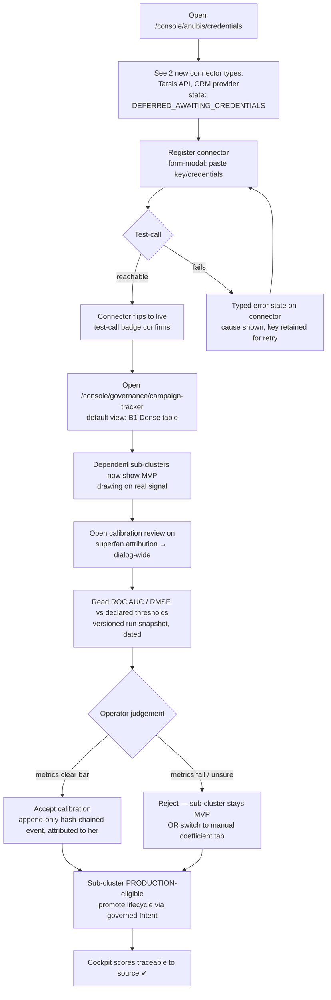
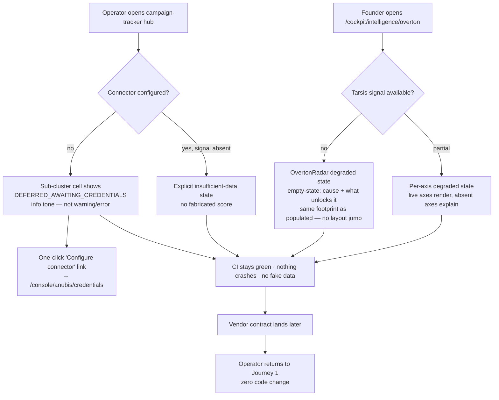
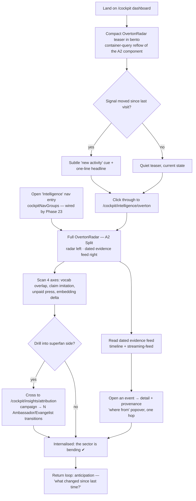
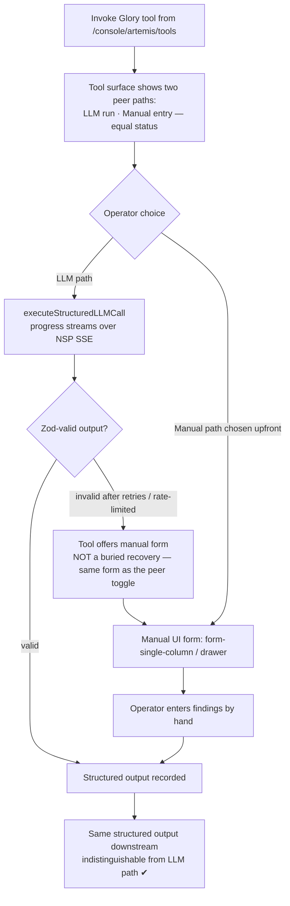

---
stepsCompleted:
  - step-01-init
  - step-02-discovery
  - step-03-core-experience
  - step-04-emotional-response
  - step-05-inspiration
  - step-06-design-system
  - step-07-defining-experience
  - step-08-visual-foundation
  - step-09-design-directions
  - step-10-user-journeys
  - step-11-component-strategy
  - step-12-ux-patterns
  - step-13-responsive-accessibility
  - step-14-complete
lastStep: 14
workflowComplete: true
inputDocuments:
  - _bmad-output/planning-artifacts/prd.md
  - _bmad-output/planning-artifacts/architecture.md
  - _bmad-output/planning-artifacts/closure-roadmap.md
  - _bmad-output/planning-artifacts/implementation-readiness-report-2026-05-14.md
  - _bmad-output/project-context.md
  - CLAUDE.md
  - docs/governance/DESIGN-SYSTEM.md
  - docs/governance/DESIGN-LEXICON.md
  - docs/governance/DESIGN-A11Y.md
  - docs/governance/DESIGN-I18N.md
  - docs/governance/DESIGN-MOTION.md
  - _bmad/custom/_nefer-checks.md
  - _bmad/custom/_nefer-facts.md
workflowType: 'ux-design'
project_name: 'ADVE-project'
user_name: 'Alexandre'
date: '2026-05-14'
target: 'Phase 23 — Câblage des mécaniques pivot mission (superfans × Overton) MVP→PRODUCTION'
phase_label: 'phase/23'
target_portals: ['Console', 'Cockpit']
nefer_preflight:
  C1_read_project_memory: done
  C2_anti_doublon_grep: done — step-02, corrected post step-09 against the canonical route map + portal-configs.ts. OvertonRadar = net-new domain component (0 hits, MISSION.md §5 dérive #5), composes existing radar-chart pattern. All other surfaces EXTEND existing routes (/console/anubis/credentials, /console/governance/campaign-tracker, /cockpit/insights/attribution, /console/artemis/tools). 1 net-new route /cockpit/intelligence/overton (mission step [5] Overton namespace — NOT /cockpit/insights/* which is steps [3]+[4]; /cockpit/intelligence/track is the pillar-T Trend Tracker, a distinct concept) + 1 nav entry wired into cockpitNavGroups (new minimal "Intelligence" group).
  C3_lexicon_reformulation: done — step-02. Canonical terms used throughout; founder-facing Cockpit copy translates Neteru/sub-cluster vocabulary per LEXICON.md.
  C4_apogee_three_laws: done — inherited from PRD; UX introduces no business mutation, no new Intent kind, no altitude regression.
---

# UX Design Specification ADVE-project

**Author:** Alexandre
**Date:** 2026-05-14

---

<!-- UX design content will be appended sequentially through collaborative workflow steps -->

## Executive Summary

### Project Vision

Phase 23 converts La Fusée's two mission-pivot mechanics — superfan accumulation
and Overton-window shift — from **placebo to instrument**. Today the Cockpit shows
superfan/Overton scores computed from Jaccard token overlap: strategist's intuition
dressed as data. The UX mandate is to make the placebo→real transition **visible and
trustworthy** — an operator who can trace every score to its signal source, and a
founder who sees dated, concrete proof that their sector is bending around them.
A metric the founder cannot see, or cannot trust, does not change behaviour; this
chantier exists to make MISSION.md's core sentence literally true at the UI layer.

### Target Users

Two sharply distinct planes, one data model, two UX registers.

**Amina — UPgraders operator (Console).** Power user, fluent in Neteru vocabulary,
desktop, dense surfaces. Success = *configurability without code*: she registers the
Tarsis-monitoring API and CRM connectors in the Credentials Vault, watches them flip
from `DEFERRED_AWAITING_CREDENTIALS` → live, runs a calibration review of the
attribution model against real campaign history, and **owns the statistical
judgment** — accepting or rejecting ROC AUC / RMSE thresholds before any sub-cluster
reaches PRODUCTION. Her surfaces: `/console/anubis/credentials` (connectors,
extended) and `/console/governance/campaign-tracker` (sub-cluster status +
calibration + governed lifecycle promotion).

**Étienne — Founder (Cockpit).** Read-only, paid-tier-gated, low cognitive load.
La Fusée OS is **invisible** to him — all Neteru/sub-cluster vocabulary is translated
to user-facing language per LEXICON.md. Success = *seeing the sector bend*: a compact
`<OvertonRadar>` teaser on his `/cockpit` dashboard, a full `<OvertonRadar>` on the
net-new `/cockpit/intelligence/overton` route (competitor vocabulary overlap, dated
claim-imitation log, unpaid-press feed, sectoral-embedding delta), and a campaign's
evangelist lineage on the extended `/cockpit/insights/attribution` page — proof, not
sentiment.

### Key Design Challenges

1. **The honest empty/degraded state is the primary design surface, not an edge
   case.** Phase 23 ships before vendor keys exist. `DEFERRED_AWAITING_CREDENTIALS`,
   insufficient-data, and degraded states must be designed first-class across
   connectors, sub-clusters, Glory tools, and the OvertonRadar — never blank panels,
   never fabricated data (no-magic-fallback, ADR-0046).
2. **Manual-first parity as a UX invariant (ADR-0060).** Every LLM path — 5
   measurement Glory tools, attribution coefficient entry, Overton-delta tagging —
   needs a functionally equivalent manual form producing *indistinguishable* output.
   The manual path must read as a peer, not a degraded fallback.
3. **Trust transfer on the placebo→real jump.** Scores will visibly move when real
   signal lands. Without a traceable "where does this number come from" affordance,
   the operator cannot defend the jump to the client — it erodes trust instead of
   building it.
4. **Two-plane translation.** The same mechanics surface as power-tool density
   (Console, `compact`) and invisible-OS storytelling (Cockpit, `comfortable`) —
   each respecting its portal's design-system density token and vocabulary register.

### Design Opportunities

1. **OvertonRadar as the signature differentiator.** No martech incumbent
   (Brandwatch, Sprinklr, Talkwalker) instruments cultural-window displacement. This
   component *is* the release's "aha" moment — get it right and it carries the whole
   chantier.
2. **Calibration-review panel as operator empowerment.** Surfacing the metrics —
   not a pass/fail badge — and letting the operator own the judgment is a
   trust-by-construction pattern worth making canonical for future ML surfaces.
3. **Connector health as a glanceable lifecycle.** A clean `DEFERRED → test-call →
   live` state machine makes integration health diagnosable without server logs
   (NFR11) — a reusable pattern for every future Credentials Vault connector.

### Resolved Placement Decisions (binding for downstream steps)

| Surface | Decision | Rationale |
|---|---|---|
| OvertonRadar | **Hybrid** — compact teaser on `/cockpit` dashboard + full panel on net-new `/cockpit/intelligence/overton` route, wired into `cockpitNavGroups` (new minimal "Intelligence" group) | Correct mission-step-[5] Overton namespace; teaser + nav entry both satisfy MISSION §9 "every founder sees the Overton axis" |
| Attribution lineage (founder) | Extend `/cockpit/insights/attribution` | Existing surface (steps [3]+[4] Accumulation/Gravité); no net-new route |
| _Route correction (post step-09)_ | OvertonRadar moved `/cockpit/insights/overton` → `/cockpit/intelligence/overton` | `insights/*` = mission steps [3]+[4]; `intelligence/*` = step [5] Overton. `/cockpit/intelligence/track` is the pillar-T Trend Tracker (49 variables) — a distinct concept, not extensible for Overton |
| Connectors (operator) | Extend canonical Credentials Vault `/console/anubis/credentials` | ADR-0021 — single home for all external connectors; relocating = doubling |
| Sub-cluster status + calibration + lifecycle promotion | `/console/governance/campaign-tracker` (Phase 19 hub) | Promotion is a governed Intent → `governance` namespace; module spans cross-Neteru |
| 5 measurement Glory tools (operator) | Surface in Glory tools catalogue `/console/artemis/tools` + manual-form path | Existing catalogue; manual-first parity |
| Net-new component | `<OvertonRadar>` only — composes existing `radar-chart` pattern (DESIGN-SYSTEM §15.I) | PRD constraint: 1 net-new UI component |

## Core User Experience

### Defining Experience

Phase 23 has two distinct core loops, one per plane — but they share a single
spine: **trace a number to its source**.

**Operator core loop (Console) — "wire, review, promote."** The defining
interaction is the *calibration review*: Amina opens a sub-cluster on
`/console/governance/campaign-tracker`, sees its evaluation metrics
(ROC AUC / RMSE) against declared thresholds, and accepts or rejects. Connector
wiring (`/console/anubis/credentials`) is the one-time precondition; the
calibration review is the recurring act that defines her relationship to the
product. If this one interaction is effortless and legible, the rest of the
operator surface follows.

**Founder core loop (Cockpit) — "glance, then drill."** The defining interaction
is *OvertonRadar discovery*: Étienne glances at the compact teaser on his
`/cockpit` dashboard, and when something moves, drills into the full
`/cockpit/intelligence/overton` panel for the dated evidence. It is primarily
observational — the founder does not configure or compute, he *witnesses*. The
make-or-break is that what he witnesses is concrete and dated, never a vague gauge.

### Platform Strategy

- **Web, App-Router, desktop-first.** No mobile app, no CLI, no PWA — inherited
  from the project-type config. Console and Cockpit are both desktop-first
  surfaces; responsive down to tablet (`md`, 768px) but not optimised for phone.
- **Mouse/keyboard primary.** Full keyboard navigation is a hard requirement
  (DESIGN-A11Y §4) — calibration accept/reject, tab navigation in the radar's
  text-equivalent data view, modal focus traps.
- **No offline mode.** Signal collection, calibration runs, and connector
  test-calls are all server-bound; the UI degrades to explicit
  `DEFERRED_AWAITING_CREDENTIALS` / insufficient-data states, never to a cached
  fake.
- **Density per portal.** Console = `compact` (dense status grids, metric
  tables). Cockpit = `comfortable` (storytelling cards, bento). Each layout
  declares its `data-density` token per DESIGN-SYSTEM §8.
- **Streaming over NSP SSE.** Calibration runs and signal polls stream progress
  (15s heartbeat, NFR3) — reuse the canonical SSE emitter pattern; the operator
  never faces a frozen screen.
- **Real-time render budget.** `<OvertonRadar>` first meaningful render ≤ 2s on
  cached signal, behind a Suspense boundary — never blocks the Cockpit shell
  (NFR2).

### Effortless Interactions

- **Connector state is self-evident.** `DEFERRED → test-call → live` reads at a
  glance — no log-diving to know if a connector works (NFR11). The test-call
  result is a badge, not a buried API response.
- **The "configure connector" path is one click.** A `DEFERRED` sub-cluster on
  the campaign-tracker hub links straight into the Credentials Vault — the
  operator never hunts for where to fix it (PRD Journey 2).
- **Manual-first is a peer toggle, not a recovery flow.** Switching a Glory tool
  or a model to its manual form is a deliberate, equal-status choice — not a
  buried fallback the user discovers only after the LLM path errors.
- **Provenance is always one hop away.** Every score — in the Cockpit and the
  Console — carries a "where does this come from" affordance that reaches the
  signal source or the calibration snapshot without a context switch.
- **Empty states do the explaining.** A degraded OvertonRadar tells the founder
  *what* is missing and *what unlocks it* — it never just shows nothing.

### Critical Success Moments

- **The placebo→real flip (operator).** A sub-cluster's score stops being a
  Jaccard placeholder and starts moving on traceable signal. If this moment is
  unexplained, trust breaks; if it is legible, it is the whole product working.
- **Calibration sign-off (operator).** Amina reads ROC AUC / RMSE, sees the bar
  cleared, and accepts — she *owns* the statistical judgment. Failure mode:
  showing a pass/fail badge instead of the metrics, which strips her authority.
- **"A competitor used my words" (founder).** The OvertonRadar flags a dated,
  named claim-imitation event. This is the release's signature "aha" — proof,
  not sentiment. If the radar feels like decoration, the chantier fails.
- **Evangelist lineage reveal (founder).** A named campaign shows "produced N
  Ambassador→Evangelist transitions." The founder sees superfan accumulation as
  a tracked outcome, not a vanity counter.
- **Ship-without-keys, no red (operator, day one).** Phase 23 lands before the
  Tarsis contract. Every surface renders honest degraded states; nothing crashes,
  nothing fakes. The make-or-break is that "not configured yet" looks
  intentional, not broken.

### Experience Principles

1. **Honest over impressive.** A degraded or insufficient-data state, shown
   plainly, beats a fabricated score. No-magic-fallback is a UX principle, not
   just a backend rule (ADR-0046).
2. **Every number is traceable.** No score appears without a one-hop path to its
   signal source or calibration snapshot. Provenance is the antidote to the
   placebo→real trust gap.
3. **Manual and automated are peers.** The manual path is designed to equal
   status, not as a fallback — manual-first parity (ADR-0060) is visible in the
   interaction design, not just the code.
4. **The operator owns the judgment; the founder owns the witness.** Console
   surfaces metrics and decisions (the operator decides); Cockpit surfaces dated
   evidence (the founder observes). Never blur the two registers.
5. **The OS stays invisible to the founder.** All Neteru/sub-cluster vocabulary
   is translated to user-facing language in the Cockpit (LEXICON.md). Étienne
   sees "your sector", "your campaign" — never "Seshat", "culture.overtonShift".

## Desired Emotional Response

### Primary Emotional Goals

The single primary emotion Phase 23 must produce is **grounded confidence** —
the feeling of standing on something real. Every other emotional goal is a
facet of it.

- **Operator (Amina): defensible authority.** She should feel she can stand in
  front of a client and *defend every number* — not "the dashboard says 0.58"
  but "0.58, here is the signal, here is the calibration I accepted." The
  emotion that makes her tell a peer about it: *"I finally control what I'm
  showing the client."*
- **Founder (Étienne): vindicated witness.** He should feel the quiet thrill of
  *seeing proof of something he suspected* — the sector is bending around him,
  and now it is dated and named, not a hunch. The shareable emotion: *"Look —
  a competitor literally used my words."*

### Emotional Journey Mapping

| Stage | Operator (Console) | Founder (Cockpit) |
|---|---|---|
| **First discovery** | Recognition, not novelty — "this is the Vault I already use, two new connector types." Calm familiarity. | Curiosity at a new panel on a familiar dashboard — intriguing, not demanding. |
| **Core action** | Focused deliberation during calibration review — she is weighing, not waiting. In control of a judgment. | Slow-burn engagement — the radar rewards return visits as signal accrues; patience, not impatience. |
| **Completion / success** | Earned trust — accepting calibration feels like a decision she made, not a button she pressed. | Vindication — the dated claim-imitation event, the evangelist lineage: "I was right, and here's the proof." |
| **When something goes wrong** | Diagnostic clarity, never alarm — a `DEFERRED` connector or insufficient-data state reads as a known, expected condition with a clear next step. | Honest reassurance — a degraded radar says "awaiting signal, here's what unlocks it." Disappointment, never confusion or suspicion. |
| **Returning** | Settled routine — calibration becomes a trusted recurring ritual. | Anticipation — "what has the sector done since last time?" |

### Micro-Emotions

The critical micro-emotional axes for Phase 23's success:

- **Trust vs. Skepticism** — *the* decisive axis. The placebo→real flip either
  builds trust (traceable) or breeds skepticism (unexplained jump). Everything
  bends to keeping the user on the trust side.
- **Confidence vs. Confusion** — the operator must feel confident reading
  ROC AUC / RMSE; the founder must never be confused by OS vocabulary leaking
  into the Cockpit.
- **Accomplishment vs. Frustration** — calibration sign-off and the "configure
  connector" one-click path must land as accomplishment; dead-ends and
  log-diving are the frustration to design out.
- **Reassurance vs. Anxiety** — degraded and empty states must reassure ("this
  is expected, here's the path"), never trigger anxiety ("is this broken?").

Deliberately *not* chasing **delight/surprise** as a primary goal — surprise
undermines trust in a measurement instrument. The OvertonRadar's "aha" is a
*recognition* moment, not a *novelty* moment.

### Design Implications

- **Grounded confidence → traceability affordances everywhere.** Every score
  carries a one-hop "where from" link to its signal source or calibration
  snapshot. Provenance is the load-bearing emotional device.
- **Defensible authority → metrics over verdicts.** The calibration panel shows
  ROC AUC / RMSE values against thresholds, not a green/red badge. The operator
  decides; the UI informs.
- **Diagnostic clarity → first-class degraded states.** `DEFERRED`,
  insufficient-data, and degraded states get designed empty-state treatments
  (icon + cause + unlock path), not blank panels or error toasts.
- **Vindicated witness → dated, named, concrete evidence.** The OvertonRadar
  leads with specific events ("[Competitor] used '[phrase]' on [date]"), not
  aggregate gauges. Concreteness is the emotion.
- **Reassurance → honest, explanatory copy.** Empty/degraded copy explains and
  points forward; it never apologises vaguely or hides the cause.
- **Calm familiarity → extend, don't reinvent.** New connector types appear
  inside the Vault the operator already knows; the radar appears on the
  dashboard the founder already visits. No new mental models.
- **No false delight → restrained motion.** Score reveals and radar updates use
  measured motion (DESIGN-MOTION `--motion-base`/`--motion-medium`), not
  celebratory animation. An instrument, not a slot machine.

### Emotional Design Principles

1. **Trust is the product.** When a design choice trades trust for impressiveness,
   trust wins — every time.
2. **Show the work, not the verdict.** Surfacing the reasoning (metrics, signal
   source, calibration snapshot) produces confidence; hiding it behind a badge
   produces skepticism.
3. **Honest beats reassuring-but-false.** A degraded state told plainly is
   emotionally safer than a fabricated score — the user can act on honesty.
4. **Recognition over surprise.** The signature emotional moment is "I knew it —
   and here's the proof," not "wow, didn't expect that." Measurement instruments
   earn trust by being predictable.
5. **Each plane keeps its register.** Console feels like deliberate control;
   Cockpit feels like calm witnessing. Never make the founder feel like an
   operator, or the operator feel managed.

## UX Pattern Analysis & Inspiration

### Inspiring Products Analysis

Four anchors, each mapped to a specific Phase 23 surface — plus the PRD's own
named anti-pattern set.

**Stripe Dashboard → Credentials Vault connector UX.** Stripe makes credential
configuration feel safe and legible: a clear test-mode/live distinction, keys
that are write-once and never re-displayed, and an event log where every number
links to "view event" — provenance is one click, always. Errors are typed and
explained, never raw. *Maps to:* connector registration, the
`DEFERRED → test-call → live` lifecycle, the "where does this come from"
affordance.

**Vercel / Datadog → connector & sub-cluster health.** Both make integration
health a glanceable system, not a log-dive: a status dot, a last-check
timestamp, a one-line cause when degraded. Datadog in particular treats "no
data yet" as a designed state with a configuration path, not an empty chart.
*Maps to:* the campaign-tracker sub-cluster status grid, connector test-call
badges, NFR11 (health diagnosable without server logs).

**Linear → Console compact density.** Linear proves `compact` density can be
calm, not cramped — tight rows, strong typographic hierarchy, keyboard-first
navigation, status as colour + shape (never colour alone). *Maps to:* the
Console campaign-tracker hub, calibration review tables, DESIGN-A11Y keyboard
requirements.

**Weights & Biases → calibration review.** W&B surfaces model evaluation as
*data the human reads* — metric values, curves, thresholds — not a pass/fail
verdict. The practitioner owns the judgment; the tool informs it. Run history
is versioned and traceable. *Maps to:* the calibration-review panel (ROC AUC /
RMSE against thresholds), FR20–FR24, the "operator owns the judgment" principle.

**Anti-pattern source — Brandwatch / Sprinklr / Talkwalker.** Social-listening
incumbents instrument reach and sentiment with vanity gauges: big aggregate
numbers, no provenance, "sentiment: 72% positive" with no path to *why*. They
are the cautionary baseline — impressive-looking, un-defensible.

### Transferable UX Patterns

**Navigation & information hierarchy**
- *Glanceable status system* (Vercel/Datadog) → the sub-cluster status grid:
  status dot + lifecycle stage + last-signal timestamp, scannable in one pass.
- *Compact-but-calm row density* (Linear) → Console calibration tables and the
  campaign-tracker hub — tight, keyboard-navigable, hierarchy via type not noise.

**Interaction patterns**
- *Write-once credential entry + test-call confirmation* (Stripe) → connector
  registration in the Credentials Vault; key never re-displayed, reachability
  confirmed by an explicit test badge.
- *One-click provenance* (Stripe "view event") → every score in Console and
  Cockpit links to its signal source or calibration snapshot.
- *Metrics-as-data, not verdict* (W&B) → calibration panel shows the numbers
  and the thresholds; accept/reject is the operator's act.
- *Designed "no data yet" state with a configuration path* (Datadog) → the
  template for every `DEFERRED` / insufficient-data / degraded surface.

**Visual patterns**
- *Status as colour + shape + label* (Linear) → never colour alone (DESIGN-A11Y);
  applies to connector state, sub-cluster lifecycle, calibration outcome.
- *Restrained, financial-grade legibility* (Stripe) → supports "grounded
  confidence"; the OvertonRadar reads as an instrument, not an infographic.
- *Versioned run history* (W&B) → calibration snapshots are listed, dated,
  and re-openable — reproducibility made visible.

### Anti-Patterns to Avoid

- **Vanity gauges without provenance** (Brandwatch/Sprinklr) — a big number with
  no path to its source. Directly conflicts with "every number is traceable."
- **Pass/fail verdict instead of metrics** — hiding ROC AUC / RMSE behind a
  green badge strips the operator's authority. W&B's lesson inverted.
- **Blank or fake empty states** — an empty chart with no explanation, or worse,
  a cached/placeholder number. Violates no-magic-fallback (ADR-0046).
- **Manual path as a buried error-recovery flow** — discoverable only after the
  LLM path fails. Manual-first parity requires it to be a visible peer toggle.
- **Re-displaying or logging credentials** — Stripe's discipline inverted;
  also an NFR4 security violation.
- **OS vocabulary leaking into the Cockpit** — "sub-cluster", "Seshat",
  "culture.overtonShift" in front of the founder. Breaks the invisible-OS rule.
- **Celebratory animation on a measurement instrument** — undermines trust;
  surprise is not the goal (recognition is).

### Design Inspiration Strategy

**What to adopt (use largely as-is)**
- Stripe's write-once credential entry + explicit test-call confirmation —
  proven, safe, and the Credentials Vault already follows this shape (ADR-0021).
- W&B's metrics-as-data calibration view — show curves/values/thresholds, let
  the operator decide.
- Datadog's "no data yet" designed state — adopt as the canonical template for
  all Phase 23 degraded/empty surfaces.

**What to adapt (modify for our context)**
- Linear's compact density — adapt to the Console `data-density="compact"`
  token and the panda/rouge design system; keep the calm, drop any borrowed
  colour language.
- Vercel/Datadog's glanceable health system — adapt to the cross-Neteru
  sub-cluster model (status + lifecycle stage + signal freshness in one row).
- Stripe's "view event" provenance — adapt into a consistent one-hop
  "where from" affordance spanning both planes, reaching either a signal source
  or a calibration snapshot.

**What to avoid (explicit non-goals)**
- The incumbent vanity-gauge aesthetic — no big context-free numbers anywhere.
- Any verdict-over-metrics shortcut in the calibration panel.
- Any empty/degraded state that doesn't explain its cause and unlock path.

This strategy keeps Phase 23 grounded in proven, trust-oriented patterns while
its signature surface — the `<OvertonRadar>` — stays genuinely novel: no anchor
product instruments cultural-window displacement, so the radar adapts the
*legibility discipline* of these tools without copying any of their charts.

## Design System Foundation

### 1.1 Design System Choice

**Custom design system — La Fusée "panda + rouge fusée" (Phase 11, ADR-0013).**

This is not a decision taken in this workflow; it is an inherited, governed
constraint. La Fusée ships a complete custom design system: a 4-tier token
cascade (Tier 0 Reference → Tier 1 System → Tier 2 Component → Tier 3 Domain),
~36 migrated primitives with CVA variants and co-located `*.manifest.ts`, a
~60-pattern matrix, per-portal density tokens, and CI-enforced anti-drift
(`design-tokens-cascade`, `design-tokens-canonical`, `design-primitives-cva`).
Phase 23 consumes this system as-is. The only design-system-level work is one
net-new domain component, `<OvertonRadar>`, built strictly within the cascade.

### Rationale for Selection

- **Brownfield invariant, not a greenfield choice.** Phase 23 extends existing
  Console and Cockpit surfaces inside an OS where the design system is canon.
  Introducing or mixing in an external system (Material, Ant, MUI) would be a
  governance drift and would fail the three absolute Design-System prohibitions.
- **PRD makes it explicit.** NFR14 requires `<OvertonRadar>` to consume design
  tokens only, with CVA variants, no raw Tailwind colour classes — i.e. the
  existing system, no exception.
- **The inspiration strategy already assumes it.** Step 5's "adapt" column
  (Linear density, Datadog health, Stripe provenance) maps the borrowed
  *patterns* onto La Fusée tokens — the visual language stays panda + rouge.
- **A11y and i18n come for free.** WCAG AA (AAA on body text), focus-ring
  tokens, RTL logical properties, font-scaling — all already in the system's
  governance docs and CI. Phase 23 inherits compliance instead of re-earning it.

### Implementation Approach

- **Extend, do not reinvent.** Every Phase 23 surface composes existing
  primitives (`card`, `badge`, `button`, `dialog`, `progress`, `field`, `tabs`,
  `popover`, `data-table-dense`, `empty-state`, etc.) and existing patterns.
- **Tokens only, via the cascade.** All colour, spacing, motion, z-index, and
  typography come from Tier 1/2/3 tokens. No component consumes a Tier 0
  Reference token directly; no raw Tailwind colour class outside
  `primitives/**`. Enforced by the bloquant CI tests.
- **CVA for every multi-variant element.** `<OvertonRadar>` and any new
  composition use `cva()` with the canonical variant grammar (`variant`, `size`,
  `tone`, `state`, `density`, `surface`) — never inline `.join(" ")` or ternaries.
- **Co-located manifest.** `<OvertonRadar>` ships `overton-radar.tsx` +
  `overton-radar.manifest.ts` (Zod, `defineComponentManifest`) +
  `overton-radar.stories.tsx` + `overton-radar.test.tsx`, and updates
  `COMPONENT-MAP.md` in the same PR.
- **Per-portal density respected.** Console surfaces render under
  `data-density="compact"`, Cockpit under `data-density="comfortable"` — the
  same data model, two density registers (DESIGN-SYSTEM §8).
- **Motion from tokens.** Score reveals and radar updates use
  `--motion-base` / `--motion-medium` with `--ease-out`; full
  `prefers-reduced-motion` fallback (DESIGN-MOTION §4).

### Customization Strategy

Phase 23 adds **one** net-new design-system artifact — `<OvertonRadar>` — and
extends existing patterns for everything else.

- **`<OvertonRadar>` = a Tier 3 domain composition over the existing
  `radar-chart` pattern (DESIGN-SYSTEM §15.I).** It is not a new primitive; it
  composes `radar-chart` + `card` + `badge` + `timeline` (for the dated
  claim-imitation log) + `streaming-feed` (unpaid-press) + `empty-state` (the
  degraded surface). New domain tokens, if any, sit in Tier 3 (`domain.css`)
  and read from Tier 1/2 only.
- **A11y contract for the radar (NFR13).** `<svg role="img">` with an
  `aria-label` summarising the values, plus an offscreen text-equivalent data
  table (DESIGN-A11Y §3 RadarChart pattern); keyboard-navigable; colour never
  the sole signal carrier — every signal axis carries label + shape.
- **Reused patterns, no new components, for the rest:**
  - Calibration-review panel → `dialog-wide` / `bento-nested` + `kpi-grid` +
    `data-table-comparison` (metrics vs thresholds).
  - Sub-cluster status grid → `data-table-dense` + status `badge` (colour +
    shape + label) + `popover` for provenance.
  - Connector registration → `form-modal` + `field-*` + test-call `badge`.
  - Glory tool manual forms → `form-single-column` / `form-drawer` + `field-*`.
  - Every degraded/empty surface → the `empty-state` primitive
    (`icon` + `title` + `description` + `cta`), per the Datadog-derived template.
- **No new portal, no new density token, no new Tier 0/1 token.** The
  customization surface area is deliberately minimal — one domain component,
  governed end-to-end.

## 2. Core User Experience

### 2.1 Defining Experience

Phase 23 has one defining experience per plane, joined by a single spine —
**trace a number to its source** — and each must be nailed independently.

**Operator (Console) — the calibration review.** *"I read the model's real
numbers and I decide."* This is the interaction Amina describes to a peer: not
"I configured a connector" but "I reviewed the attribution model against real
campaign history, the metrics cleared the bar, and I signed it off." It is the
gating act of the whole release's credibility — if the calibration review is
legible and the operator feels ownership, every other Console surface is
downstream of it.

**Founder (Cockpit) — the OvertonRadar reveal.** *"I can see my sector bending
around me."* This is the interaction Étienne describes: "the radar flagged it —
a competitor used a phrase from my manifesto, on a date." A recognition moment,
not a configuration moment. If this lands as concrete dated proof, the founder
internalises the mission mechanic; if it reads as a decorative gauge, the
chantier fails its signature promise.

The shared spine: in both, the user's confidence comes from being **one hop
from the evidence** — the calibration snapshot, or the dated signal event.

### 2.2 User Mental Model

**Operator.** Amina's mental model is the *lab review*, not the *dashboard
glance*. She brings the expectation of a scientific instrument: she wants to see
the metric, the threshold, the run it was computed on — and to be the one who
accepts it. Today's pain: the Cockpit scores are Jaccard placeholders she
*cannot defend to a client* — her workaround is verbal hedging ("it's
directional"). She expects the connector flow to mirror the Credentials Vault
she already uses for ad networks; anything that diverges from that pattern
breaks her model. Likely confusion point: conflating "connector live" with
"sub-cluster trustworthy" — the UI must keep wiring and calibration as distinct
mental steps.

**Founder.** Étienne's mental model is the *evidence feed*, not the *analytics
report*. He brings the expectation of *witnessing*, not operating — he does not
think in models or sub-clusters and must never be asked to. Today's pain: he has
only anecdotes that his sector is imitating him; his workaround is screenshotting
competitor posts. He expects the radar to *show him things that happened*, dated
and named. Likely confusion point: a degraded/empty radar reading as "nothing is
happening in my sector" rather than "the signal source isn't connected yet" —
the empty state must disambiguate this explicitly.

### 2.3 Success Criteria

**Operator core experience succeeds when:**
- The calibration panel shows ROC AUC / RMSE *values* against *named thresholds*
  — Amina never has to ask "is this good?", she reads it.
- Accept/reject is one deliberate action, hash-chain-recorded, and visibly hers.
- A `DEFERRED` sub-cluster's "configure connector" path is one click into the
  Vault — no hunting.
- Connector state (`DEFERRED → test-call → live`) is legible without opening logs.
- Every promoted score links back, in one hop, to the calibration snapshot that
  justified it.

**Founder core experience succeeds when:**
- The OvertonRadar leads with *specific dated events* ("[Competitor] used
  '[phrase]' on [date]"), not aggregate gauges.
- The compact dashboard teaser communicates "something moved" at a glance and
  invites the drill-in.
- A degraded radar states *what* is missing and *what unlocks it* — never blank.
- The evangelist lineage view names a campaign and its N devotion transitions.
- Nothing in the Cockpit names a Neter, sub-cluster, or internal mechanic.

**Speed:** OvertonRadar first meaningful render ≤ 2s on cached signal (NFR2);
calibration run streams progress over SSE so the operator is never frozen (NFR3,
p95 ≤ 60s).

### 2.4 Novel UX Patterns

Phase 23 is **familiar patterns recombined** — deliberately, for a trust
instrument — with **one genuinely novel surface**.

**Established (adopt, don't educate):**
- Calibration review = a metrics-review table + accept/reject — the W&B pattern;
  ML practitioners already understand it.
- Connector registration = the Credentials Vault form + test-call the operator
  already uses; zero new learning.
- Sub-cluster status grid = a Datadog/Vercel-style health list.
- Manual-first forms = standard `form-*` patterns.

**Novel (needs careful first-use design):** the `<OvertonRadar>` as an
*instrument of cultural-window displacement*. No incumbent instruments this, so
there is no borrowed mental model. Mitigation — lean on familiar metaphors:
it is a *radar* (axes = signal types the founder can name: vocabulary overlap,
claim imitation, unpaid press, embedding delta) backed by an *evidence feed*
(dated event log). The novelty is in *what is measured*, not in a new interaction
grammar — the founder reads a radar and scrolls a feed, both familiar. First-use
support: an honest empty state that doubles as an explainer of what each axis
will show once signal accrues.

### 2.5 Experience Mechanics

**A — Operator: the calibration review**

1. **Initiation.** Amina opens `/console/governance/campaign-tracker`. A
   sub-cluster (e.g. `superfan.attribution`) shows an MVP badge and a
   "Calibration review available" affordance. She opens the calibration panel
   (`dialog-wide`).
2. **Interaction.** The panel runs / shows the regression against the account's
   real campaign history. It displays ROC AUC and RMSE as values, each beside
   its declared acceptance threshold (`data-table-comparison` + `kpi-grid`). A
   versioned run snapshot is named and dated. Progress streams over SSE if the
   run is live. Amina can switch to the **manual coefficient-entry** tab — a
   peer toggle, equal status — if she wants to set coefficients by hand.
3. **Feedback.** Each metric is shown as value + threshold + a colour-and-shape
   indicator of clearance (never colour alone). The run snapshot is one click
   from the underlying campaign history. If signal is too sparse, an explicit
   insufficient-data state appears — no fabricated metric.
4. **Completion.** Amina clicks Accept (or Reject). The decision is recorded as
   an append-only, hash-chained governance event and the sub-cluster becomes
   PRODUCTION-eligible. The panel confirms with the decision attributed to her
   and a link to the snapshot. Next: she can promote the lifecycle
   (STUB→MVP→PRODUCTION) via the governed-Intent action, or move to the next
   sub-cluster.

**B — Founder: the OvertonRadar reveal**

1. **Initiation.** Étienne lands on `/cockpit`. A compact `<OvertonRadar>`
   teaser sits in the dashboard bento. When signal has moved since his last
   visit, the teaser surfaces a subtle "new activity" cue and a one-line
   headline ("A competitor echoed your language").
2. **Interaction.** He clicks through to `/cockpit/intelligence/overton` — the full
   `<OvertonRadar>`: the radar (four named axes) plus a dated claim-imitation
   log (`timeline`), an unpaid-press feed (`streaming-feed`), and the
   sectoral-embedding delta line. He can open any event for its detail and
   provenance. He can cross to `/cockpit/insights/attribution` to see a
   campaign's evangelist lineage.
3. **Feedback.** Every item is dated and named — concrete, not aggregate. The
   "where from" affordance reaches the signal source. If the Tarsis connector
   is unconfigured or signal is absent, an honest degraded state explains the
   cause and what unlocks it (`empty-state`), per-axis where relevant.
4. **Completion.** There is no "done" — this is observational. Success is the
   *internalisation*: Étienne leaves believing, with evidence, that his sector
   is bending around him. The return loop is anticipation: "what changed since
   last time?"

## Visual Design Foundation

> Inherited canon — Phase 23 consumes the La Fusée design system unchanged
> (panda + rouge fusée, ADR-0013). This section maps the existing foundation
> onto Phase 23's specific surfaces; it introduces no new Tier 0/1 tokens.

### Color System

**Palette: panda (ink/bone) + rouge fusée accent.** The 4-tier cascade is
binding — every Phase 23 surface consumes Tier 1 System / Tier 2 Component /
Tier 3 Domain tokens, never a Tier 0 Reference token directly, never a raw
Tailwind colour class.

Semantic mapping as it applies to Phase 23:

| Role | Token | Phase 23 usage |
|---|---|---|
| Surfaces | `--color-background`, `--color-surface-raised/elevated/overlay` | campaign-tracker grid, calibration `dialog-wide`, OvertonRadar card |
| Text | `--color-foreground` / `-secondary` / `-muted` | metric values (foreground), thresholds + timestamps (secondary), helper copy (muted) |
| Accent (rouge) | `--color-accent` / `-hover` / `-active` | primary actions: Accept calibration, Register connector, drill-into-radar CTA |
| Success | `--color-success` (green) | calibration metric *clears* threshold; connector `live` |
| Warning | `--color-warning` (amber) | calibration *near* threshold; signal *stale* |
| Error | `--color-error` (rouge) | calibration *fails* threshold; connector test-call failed |
| Info | `--color-info` (blue) | `DEFERRED_AWAITING_CREDENTIALS` / insufficient-data states — a neutral, non-alarming tone |

**Status colour discipline.** Connector state, sub-cluster lifecycle, and
calibration outcome are *never colour-only* — each pairs the token with a shape
and a text label (DESIGN-A11Y §8). `DEFERRED` deliberately uses the **info**
tone, not warning/error: ship-without-keys is an expected condition, not a
fault.

**OvertonRadar colour.** The radar's four axes are distinguished by
label + position + shape first; colour (drawn from Tier 3 domain tokens reading
Tier 1) is reinforcement only. The sectoral-embedding delta line uses
`--color-accent` to mark movement; flat/no-movement uses `--color-foreground-muted`.

### Typography System

**Inherited fluid type scale** (`--text-xs` … `--text-mega`, `clamp()`-based,
`vw + rem` — font-scaling-200%-safe). No new type tokens.

- **Tone:** restrained, instrument-grade — matches "grounded confidence", not
  "delightful". Editorial flourish belongs to the landing portal, not here.
- **Console (campaign-tracker, calibration):** dense, hierarchy via weight and
  `--text-sm` / `--text-base`; metric *values* get `--text-lg`+ to read as the
  focal data; thresholds and run timestamps sit at `--text-xs` / `--text-sm`
  secondary.
- **Cockpit (OvertonRadar, attribution lineage):** `comfortable` register;
  event headlines at `--text-lg`, dated detail at `--text-sm`. The radar's
  one-line dashboard-teaser headline may use `--text-xl` for glanceability.
- **Numerals:** tabular figures for all metrics, thresholds, and counts so
  values align in tables and don't jitter on live update.
- **Long-form:** none in scope — Phase 23 surfaces are data + short copy;
  `overflow-wrap: anywhere` still applies to signal-source URLs and hashes.

### Spacing & Layout Foundation

**Density is per-portal, declared via `data-density` on the layout** (no
hardcoded spacing):

| Surface | `data-density` | Feel | Card padding / gap |
|---|---|---|---|
| Console — campaign-tracker hub, calibration panel | `compact` | dense, efficient, Linear-grade calm | 12px / 8px |
| Cockpit — OvertonRadar tab, dashboard teaser, attribution lineage | `comfortable` | storytelling, breathing room | 20px / 16px |

- **Spacing unit:** the system's existing scale (`--space-*`); Tailwind
  `gap-*` / `p-*` consume it. No new base unit.
- **Grid:** existing breakpoints (`xs`→`2xl`); both portals desktop-first,
  responsive to tablet (`md`, 768px — sidebar appears). The campaign-tracker
  status grid uses `data-table-dense`; the OvertonRadar tab uses
  `bento-asymmetric` (radar + event log + press feed + delta line).
- **Container queries** for the OvertonRadar card so the dashboard teaser and
  the full-tab instance reflow on *their own* width, not the viewport's.
- **Z-index:** named tokens only (`--z-modal` for the calibration `dialog-wide`,
  `--z-popover` for provenance popovers, `--z-toast` for confirmations) — no
  magic values.
- **Layout principles:**
  1. *Data is the focal layer* — metric values and dated events get visual
     primacy; chrome recedes.
  2. *Provenance is always reachable without layout disruption* — "where from"
     opens a `popover`, never a full navigation.
  3. *Degraded states occupy the same footprint as populated ones* — an
     `empty-state` fills the radar/grid slot so layout never jumps between
     `DEFERRED` and live.

### Accessibility Considerations

Inherited bar: **WCAG 2.1 AA minimum**, AAA on body text (panda gives ~16:1
natively). Phase 23-specific obligations:

- **OvertonRadar (NFR13):** `<svg role="img">` with a values-summary
  `aria-label`, plus an offscreen text-equivalent data table (DESIGN-A11Y §3
  RadarChart pattern). Keyboard-navigable; every axis carries label + shape, so
  colour is never the sole signal carrier.
- **Calibration panel:** `dialog` role, `aria-modal`, focus trap, ESC close,
  return focus. Metric pass/near/fail conveyed by icon + label + token, not
  colour alone.
- **Status indicators:** connector state and sub-cluster lifecycle use
  colour + shape + text triad everywhere.
- **Focus:** every interactive element gets the 2px rouge `--focus-ring-color`
  on `:focus-visible`; no `outline: none` without replacement.
- **Motion (NFR — DESIGN-MOTION):** score reveals / radar updates use
  `--motion-base`/`--motion-medium` + `--ease-out`; full
  `prefers-reduced-motion` fallback — no celebratory or infinite animation on a
  measurement instrument.
- **i18n:** logical properties only (`ps-`/`pe-`/`ms-`/`me-`), RTL-ready;
  all numbers/dates/currency via `Intl.*` (FCFA/XOF/XAF, EUR, USD per
  DESIGN-I18N); font-scaling-200% safe via the fluid type scale.
- **Streaming (calibration runs):** progress region is `role="status"
  aria-live="polite"` so SSE updates are announced without stealing focus.
- **Tests:** `@axe-core/playwright` — 0 critical/serious violations; the
  OvertonRadar gets a dedicated a11y spec (NFR13).

## Design Direction Decision

### Design Directions Explored

The standard "6-8 visual-language directions" exploration was deliberately *not*
run — La Fusée's visual language is locked canon (panda + rouge, ADR-0013, three
absolute DS prohibitions, bloquant CI). Exploring alternative palettes or visual
weights would be governance drift. Instead, the exploration covered **composition
/ layout directions** for the two surfaces where a genuine fork exists. All
mockups rendered in real Tier 0→1 tokens in
`_bmad-output/planning-artifacts/ux-design-directions.html`.

**Surface A — `<OvertonRadar>` full panel** (`/cockpit/intelligence/overton`, Cockpit, `comfortable`):
- *A1 Radar-hero* — radar dominates top third; evidence stacks below.
- *A2 Split* — radar left, dated evidence feed right, equal weight.
- *A3 Feed-first* — evidence log dominates; radar demoted to a summary widget.
- *A4 Bento-asymmetric* — radar + three discrete evidence panels.

**Surface B — campaign-tracker hub** (`/console/governance/campaign-tracker`, Console, `compact`):
- *B1 Dense status table* — 6 sub-clusters as dense rows; calibration in a `dialog-wide`.
- *B2 Card grid* — each sub-cluster a card with inline status + freshness.
- *B3 Master–detail* — sub-cluster list left, selected detail + inline calibration right.

All other Phase 23 surfaces (connector forms, Glory tool manual forms, the
calibration `dialog-wide`) reuse settled patterns with no layout fork — they
were not part of the exploration.

### Chosen Direction

**Surface A — `<OvertonRadar>`: A2 Split.** Radar left, dated evidence feed
right, both above the fold, equal visual weight.

**Surface B — campaign-tracker hub: a view switcher across B1 / B2 / B3.** The
hub ships all three compositions as operator-selectable views, with the choice
persisted per operator (localStorage, mirroring the sidebar-collapse pattern in
DESIGN-A11Y §4):
- **B1 Dense status table — default.** Honours Console `compact` density; all
  six sub-clusters scannable in one pass.
- **B2 Card grid — alternate.** Friendlier first read, more context per
  sub-cluster.
- **B3 Master–detail — alternate.** Deepest single-screen workflow; inline
  calibration metrics without a dialog.

### Design Rationale

**A2 Split — why.** The founder's defining experience is "glance, then drill"
(§2.1) with a hard constraint: lead with *dated, named, concrete evidence*, not
aggregate gauges (step-04, FR30). A2 is the only direction that keeps the radar
a signature object *and* puts the proof above the fold simultaneously. A1 buries
the proof; A3 sacrifices the radar's distinctiveness; A4 risks reading as a
dashboard rather than evidence. A2 also reflows cleanly via container queries
into the compact dashboard *teaser* (radar shrinks, top evidence item becomes
the headline) — one component, two instances, no divergence.

**View switcher — why.** Amina is a power user on a dense internal surface;
"configurability" is her success criterion (§Target Users). Different operator
tasks favour different views — fast triage (B1), onboarding a new account (B2),
deep calibration on one sub-cluster (B3). Forcing one composition optimises for
one task and taxes the others. A persisted view switcher is a settled power-tool
pattern, costs no new component (existing `tabs` / segmented control + the three
compositions each built from existing patterns), and adds zero governance
surface. Default B1 keeps the honest Console `compact` register for the operator
who never touches the switcher.

Both decisions hold the trust-first, honest-over-impressive principles: the
degraded/empty state shares one treatment across every OvertonRadar instance and
every hub view — layout never jumps between `DEFERRED` and live.

### Implementation Approach

- **`<OvertonRadar>` (A2 Split).** Single Tier 3 domain component composing
  `radar-chart` (left) + a dated evidence feed (right: `timeline` for
  claim-imitation + `streaming-feed` for unpaid press) + `empty-state` for the
  degraded surface. CVA variant `instance: full | teaser` drives the
  container-query reflow; same component on `/cockpit/intelligence/overton` and
  the `/cockpit` dashboard bento. Ships with manifest + stories + unit + a11y
  spec. Phase 23 also adds one `cockpitNavGroups` entry (new minimal "Intelligence"
  group) so the route is reachable without depending on the teaser alone.
- **campaign-tracker hub view switcher.** A segmented control (existing `tabs`
  primitive or a CVA segmented-button variant) toggles three view components —
  `HubTableView` (`data-table-dense`), `HubCardView` (card grid), `HubDetailView`
  (master-detail split). View preference persists in localStorage per operator;
  default `table`. No new Prisma model, no new route — one page, three view
  components.
- **Calibration review.** Reached from B1/B2 via a `dialog-wide`; rendered
  inline in B3's detail pane — same calibration component, two host contexts.
- **Shared degraded/empty treatment.** One `empty-state`-based pattern
  (`icon` + cause + unlock path, info tone) used by every OvertonRadar instance,
  every hub view, every connector-dependent sub-cluster cell.
- **Density discipline.** Cockpit surfaces under `data-density="comfortable"`,
  Console under `compact`; B2/B3 must not silently inflate the Console density —
  they stay within `compact` spacing tokens.
- **No new visual tokens, no new portal, one net-new component** (`<OvertonRadar>`)
  — the campaign-tracker views are compositions of existing patterns.

## User Journey Flows

These flows turn the PRD's four narrative journeys into interaction mechanics,
bound to the step-09 decisions (A2 Split OvertonRadar, campaign-tracker view
switcher) and the step-04 honesty principles.

### Journey 1 — Operator wires the signal sources (happy path)

**Entry:** Amina opens `/console/anubis/credentials` (the Credentials Vault she
already uses). **Goal:** move the six pivot sub-clusters off placebo onto real
signal. **Success:** Cockpit scores become traceable to source.

### Journey 2 — Ship-without-keys graceful degradation

**Entry:** Phase 23 is on `main`; the Tarsis vendor contract is not yet signed.
**Goal:** nothing breaks, nothing fakes. **Success:** "not configured yet" looks
intentional, not broken — and the return path to J1 is zero-code.

### Journey 3 — Founder discovers the OvertonRadar (A2 Split)

**Entry:** Étienne lands on `/cockpit`, or opens the new "Intelligence" nav entry.
**Goal:** see, with dated evidence, that his sector is bending around him.
**Success:** internalised conviction — proof, not sentiment.

> Two discovery paths converge on the full panel: the `/cockpit` dashboard
> teaser (contextual, "something moved" cue) and the wired `cockpitNavGroups`
> "Intelligence" entry (durable, deliberate). Together they satisfy MISSION §9
> "every Cockpit founder sees live ... the sectoral Overton axis" — the teaser
> alone would leave it discovery-dependent.

### Journey 4 — Glory tool with manual-first fallback

**Entry:** Amina invokes a measurement Glory tool (e.g. `negative-space-auditor`)
from `/console/artemis/tools`. **Goal:** get the structured assessment. **Success:**
the result is indistinguishable downstream whether produced by LLM or by hand.

### Journey Patterns

Recurring patterns standardised across the four flows:

**Navigation patterns**
- *Cross-link by canonical ownership* — `DEFERRED` sub-cluster → one-click into
  the Credentials Vault; OvertonRadar teaser → full intelligence route; radar →
  attribution lineage. The user is never stranded.
- *Convergent discovery* — the OvertonRadar full panel is reachable from both
  the `/cockpit` teaser and the wired `cockpitNavGroups` "Intelligence" entry.
- *Hub view persistence* — the campaign-tracker view switcher (B1/B2/B3) holds
  per-operator preference; navigation never resets it.

**Decision patterns**
- *Operator-owned judgement* — every consequential branch (accept/reject
  calibration, promote lifecycle) is an explicit operator act, hash-chained and
  attributed, never an automatic transition.
- *Configured? → signal present? → degrade* — a two-gate check (J1/J2) that
  every connector-dependent surface runs, with a distinct state for each gate.

**Feedback patterns**
- *State triad* — every status (connector, sub-cluster lifecycle, calibration
  outcome) is colour + shape + label, never colour alone.
- *Provenance one hop away* — every score/event exposes a "where from" popover
  reaching its signal source or calibration snapshot.
- *Streamed progress, never frozen* — LLM runs and calibration runs stream over
  NSP SSE into an `aria-live` region.
- *Honest degraded states* — `DEFERRED` / insufficient-data / degraded each get
  an `empty-state` treatment (cause + unlock path), same footprint as populated.

### Flow Optimization Principles

1. **Minimise steps to traceable value.** J1 is the only multi-step setup flow;
   it ends the moment a score becomes source-traceable — no ceremony after.
2. **Degraded paths are designed, not afterthoughts.** J2 has the same diagram
   rigour as J1 — "ship without keys" is a first-class journey.
3. **The manual path is entered, not fallen into.** J4 offers manual as a peer
   choice upfront; the error-triggered route lands on the *same* form, so it
   never reads as a downgrade.
4. **No dead ends.** Every failure branch loops back to a retry or an
   alternative path (test-call fail → re-register; Zod-invalid → manual form;
   reject calibration → stays MVP, re-runnable).
5. **The founder never makes an operator decision, and visibility never rests
   on a single entry point.** J3 has zero mutation branches — it is pure
   observation — and two convergent discovery paths (teaser + nav); all decision
   diamonds live in J1/J4 (Console).

## Component Strategy

### Design System Components

Phase 23 consumes the La Fusée design system as-is. Coverage analysis against
the step-10 journeys:

**Primitives reused (from `src/components/primitives/`, COMPONENT-MAP):**
`card`, `badge`, `button`, `dialog`, `progress`, `field`, `label`, `input`,
`tabs`, `popover`, `icon`, `heading`, `text`, `grid`, `container`, `pagination`,
`accordion`.

**Patterns reused (DESIGN-SYSTEM §15):**
`radar-chart`, `timeline`, `streaming-feed`, `empty-state`, `data-table-dense`,
`data-table-comparison`, `kpi-grid`, `bento-asymmetric`, `dialog-wide`,
`form-modal`, `form-single-column`, `form-drawer`, `card-stat`, `card-metric`,
`progress-bar`.

**Gap analysis — result: no DS-primitive gap.**
- OvertonRadar visualisation → covered by the `radar-chart` pattern.
- Dated evidence feed → `timeline` (claim-imitation log) + `streaming-feed`
  (unpaid press).
- Calibration review → `dialog-wide` + `data-table-comparison` + `kpi-grid`.
- Sub-cluster status grid → `data-table-dense` + `badge`.
- Connector registration → `form-modal` + `field-*` + `badge`.
- Degraded/empty surfaces → `empty-state`.
- Provenance affordance → `popover`.
- View switcher → `tabs` (segmented visual variant — see below).

The single net-new artifact, `<OvertonRadar>`, is a **Tier 3 domain
composition**, not a primitive filling a gap. No new DS primitive is justified;
proposing one would fail the NEFER anti-doublon test.

### Custom Components

**One net-new design-system-level component** (the PRD-counted component) plus
**app-level compositions** that live in portal component trees and introduce no
new governed primitive.

#### `<OvertonRadar>` (net-new — Tier 3 domain component)

**Purpose:** Give the founder a single instrument showing, with dated and named
evidence, that their sector is bending around them — the signature surface of
Phase 23 (MISSION.md §5 dérive #5).
**Usage:** Two instances of one component — full panel on
`/cockpit/intelligence/overton`, compact teaser in the `/cockpit` dashboard
bento. Driven by a CVA `instance` variant; container queries reflow it.
**Anatomy (A2 Split):** `radar` (left — four labelled axes: vocabulary overlap,
claim imitation, unpaid press, embedding delta) · `evidence-feed` (right —
`timeline` of dated claim-imitation events + `streaming-feed` of unpaid press) ·
`embedding-delta-line` · `provenance` affordance per item · `empty-state` slot.
**States:** `live` (signal present) · `partial` (per-axis degraded — live axes
render, absent axes explain) · `degraded` (Tarsis connector unconfigured /
absent — honest `empty-state` with cause + unlock path) · `loading` (Suspense,
≤2s first meaningful render) · `updating` (SSE-streamed refresh).
**Variants:** `instance: full | teaser`; `density` inherited from portal
(`comfortable`).
**Accessibility (NFR13):** `<svg role="img">` + values-summary `aria-label` +
offscreen text-equivalent data table; keyboard-navigable; every axis carries
label + shape (colour never sole carrier); SSE updates into a
`role="status" aria-live="polite"` region.
**Content guidelines:** lead with specific dated events ("[Competitor] used
'[phrase]' on [date]"), never aggregate gauges; degraded copy explains what is
missing and what unlocks it; no fabricated values (no-magic-fallback).
**Interaction behaviour:** teaser surfaces a "new activity" cue + one-line
headline → click-through to full panel; in the full panel, any event opens
detail + a one-hop provenance popover; cross-link to
`/cockpit/insights/attribution`.
**Ships with:** `overton-radar.tsx` + `.manifest.ts` (Zod,
`defineComponentManifest`) + `.stories.tsx` + `.test.tsx` + dedicated a11y spec;
`COMPONENT-MAP.md` updated in the same PR.

#### App-level compositions (no new governed primitive)

- **`CampaignTrackerHub` + view switcher + `HubTableView` / `HubCardView` /
  `HubDetailView`.** Purpose: the operator's Phase-22 home. The switcher reuses
  the `tabs` primitive; if a segmented visual variant does not exist, it is
  added as a **CVA variant on the existing `tabs` primitive** (governed
  extension — not a new primitive). View preference persists per operator in
  localStorage (default `table`). The three views compose `data-table-dense` /
  card grid / master-detail split respectively.
- **`CalibrationReviewPanel`.** Purpose: the operator's defining experience.
  Composes `dialog-wide` (hosted from B1/B2) or renders inline in B3's detail
  pane — same component, two host contexts. Shows ROC AUC / RMSE as values vs
  named thresholds (`data-table-comparison` + `kpi-grid`), a versioned dated run
  snapshot, a manual-coefficient peer tab, accept/reject actions, insufficient-
  data state.
- **`ConnectorRegistrationForm`.** Purpose: register Tarsis API / CRM connectors.
  Extends the existing Credentials Vault form pattern (`form-modal` + `field-*`);
  write-once key entry, test-call `badge`, typed error state. No new component if
  the Vault form is parameterised — preferred.
- **`SubClusterStatusCell`.** Purpose: one sub-cluster's status in any hub view.
  `badge` (colour + shape + label triad) + lifecycle stage + signal-freshness
  timestamp + `DEFERRED` "configure connector" cross-link.
- **`ProvenancePopover`.** Purpose: the recurring "where does this come from"
  affordance — used by the status grid, calibration panel, OvertonRadar events,
  and Cockpit scores. A thin documented composition over `popover` reaching a
  signal source or a calibration snapshot. Documented as a Phase-22 reusable
  pattern so the four call sites stay consistent.
- **`EvangelistLineageView`.** Purpose: founder sees a campaign's N
  Ambassador/Evangelist transitions. Extends `/cockpit/insights/attribution`;
  composes `timeline` + `card-metric`.
- **Measurement Glory tool manual forms (×5).** Purpose: the manual-first peer
  path for `big-idea-coherence`, `myth-arc-cohesion`, `crew-performance-
  evaluator`, `negative-space-auditor`, `mcp-pii-classifier`. Each composes
  `form-single-column` / `form-drawer` + `field-*`; ideally schema-driven from
  the Glory tool's `outputSchema` rather than five hand-built forms.

### Component Implementation Strategy

- **Extend before composing, compose before creating.** Connector form extends
  the Vault form; the view switcher extends `tabs`; only `<OvertonRadar>` is
  genuinely net-new — and it is a composition, not a primitive.
- **Tokens-only, CVA, manifest.** `<OvertonRadar>` obeys the 4-tier cascade, uses
  CVA grammar, ships a co-located Zod manifest, and is added to `COMPONENT-MAP.md`.
- **One shared degraded/empty treatment.** A single `empty-state`-based pattern
  (icon + cause + unlock path, info tone) used by every OvertonRadar instance,
  every hub view, every connector-dependent cell — same footprint as populated.
- **One component, multiple host contexts.** `<OvertonRadar>` (full/teaser),
  `CalibrationReviewPanel` (dialog/inline) — variant-driven, never forked.
- **Schema-driven manual forms.** Generate the 5 Glory tool manual forms from
  their `outputSchema` where feasible — avoids five divergent hand-built forms.
- **No new portal, no new Tier 0/1 token, no new DS primitive.** Net new
  governance surface = one Tier 3 component + one CVA variant on `tabs` (if
  needed) + one `cockpitNavGroups` entry.

### Implementation Roadmap

Prioritised by journey criticality and the PRD MVP boundary.

**Phase 1 — Core (MVP-blocking, J1 + J2 + J3):**
- `<OvertonRadar>` (full + teaser, incl. degraded/partial states) — J3,
  blocks MISSION §9.
- `ConnectorRegistrationForm` + `SubClusterStatusCell` — J1, J2; the
  ship-without-keys degraded states.
- `CampaignTrackerHub` + `HubTableView` (default B1) — J1 entry surface.
- `CalibrationReviewPanel` — J1 defining experience.
- Shared `empty-state` degraded treatment — J2, cross-cutting.
- `cockpitNavGroups` "Intelligence" entry — J3 durable discoverability.

**Phase 2 — Supporting (completes the journeys):**
- `HubCardView` + `HubDetailView` + view switcher (`tabs` segmented variant) —
  the step-09 view-switcher decision.
- `ProvenancePopover` — the cross-cutting traceability affordance.
- `EvangelistLineageView` — J3 superfan drill-in.

**Phase 3 — Enhancement (J4, manual-first parity):**
- The 5 measurement Glory tool manual forms (schema-driven) — J4; required for
  ADR-0060 parity but not on the J1/J3 critical path.

## UX Consistency Patterns

These patterns are Phase-22 behavioural rules layered on the inherited design
system — they govern *how* the surfaces behave, not what they look like.

### Button Hierarchy

| Tier | Token / variant | Phase 23 usage | Rule |
|---|---|---|---|
| **Primary** | `--button-primary-*` (rouge accent) | Accept calibration · Register connector · drill-into-radar CTA | One primary action per surface — the consequential, forward act |
| **Secondary / ghost** | `--button-ghost-*` | Reject calibration · Switch to manual tab · Run test-call | Reversible or lateral actions |
| **Link / quiet** | `link` variant | "Configure connector" cross-link · "where from" provenance trigger | Navigation and disclosure, never mutation |

- **Governed mutations always carry a primary button** and an explicit label
  naming the act ("Accept calibration", not "Confirm") — the operator must read
  what they are committing to (hash-chained, attributed).
- **The founder's Cockpit surfaces have no mutation buttons** — only `link`/quiet
  navigation (drill-in, cross-link, open-event). Read-only is enforced by
  procedure type *and* visible in the button vocabulary.
- **Destructive / reject actions are never primary-rouge** — reject is a ghost
  action; rouge is reserved for the forward, value-creating act.
- **Loading state:** any button triggering an async Intent (calibrate, test-call,
  run Glory tool) enters `loading` (spinner + non-clickable + `aria-busy`); it
  never double-fires.

### Feedback Patterns

| State | Tone token | Carrier | Phase 23 example |
|---|---|---|---|
| Success | `--color-success` | icon + colour + label | calibration metric clears threshold; connector `live` |
| Warning | `--color-warning` | icon + colour + label | calibration *near* threshold; signal *stale* |
| Error | `--color-error` | icon + colour + label | calibration *fails*; connector test-call failed |
| Info / deferred | `--color-info` | icon + colour + label | `DEFERRED_AWAITING_CREDENTIALS`; insufficient-data |

- **State triad, always.** Every status is colour **+** shape/icon **+** text
  label — colour is never the sole carrier (DESIGN-A11Y §8).
- **`DEFERRED` is info, not warning.** Ship-without-keys is an expected
  condition; it must never read as a fault.
- **Streamed progress over a frozen screen.** Calibration runs, signal polls,
  and LLM Glory tool runs stream over NSP SSE into a
  `role="status" aria-live="polite"` region — the operator always sees motion.
- **Confirmation is attributed, not generic.** A completed governed mutation
  confirms with the act + the actor + a link to the resulting snapshot
  ("Calibration accepted by Amina · view snapshot"), not a bare toast.
- **No celebratory feedback.** Success uses restrained motion
  (`--motion-base`/`--ease-out`) — recognition, not a slot machine (step-04).

### Form Patterns

- **Write-once secrets.** Connector credentials and API keys are entered once,
  never re-displayed, never echoed, never logged (NFR4) — the field shows a
  masked "configured" state after save, with a "replace" action, never the value.
- **Test-call as inline validation.** Connector forms validate by an explicit
  test-call producing a `badge` result (reachable / failed + cause) — not just
  client-side field validation.
- **Manual-first is a peer toggle, not a recovery flow.** Every LLM-backed
  surface (5 Glory tools, attribution coefficients, Overton deltas) presents the
  manual form as an equal-status tab/toggle, visible *before* any error. The
  error-triggered route lands on the *same* form.
- **Validation timing:** structural validation on-blur; the consequential
  submit (Accept, Register) on explicit action — never auto-submit.
- **Schema-driven where possible.** The 5 Glory tool manual forms derive from
  each tool's `outputSchema` — one form pattern, not five hand-built variants.
- **Insufficient-data is a form outcome, not an error.** When signal is too
  sparse, the form returns an explicit insufficient-data state — never a
  fabricated value to "complete" the form.

### Navigation Patterns

- **Cross-link by canonical ownership.** A surface links to the *canonical home*
  of what it references: `DEFERRED` sub-cluster → `/console/anubis/credentials`;
  OvertonRadar event → its signal source; radar → `/cockpit/insights/attribution`.
  Never a stranded dead-end.
- **Convergent discovery for the founder.** The OvertonRadar full panel is
  reachable from both the `/cockpit` dashboard teaser (contextual) and the wired
  `cockpitNavGroups` "Intelligence" entry (durable) — visibility never rests on
  one entry point (MISSION §9).
- **View preference persists.** The campaign-tracker view switcher (B1/B2/B3)
  holds per-operator state in localStorage (mirroring sidebar-collapse); routing
  never resets it. Default `table`.
- **Provenance opens in place.** "Where from" opens a `popover`, never a full
  navigation — the user keeps their context (z-index `--z-popover`).
- **Calibration host is context-dependent, behaviour is not.** Reached as a
  `dialog-wide` from B1/B2, inline in B3 — same component, same interaction
  contract, ESC/return-focus identical.

### Additional Patterns

**Degraded / empty state (the cross-cutting Phase 23 pattern).**
One canonical treatment, used by every OvertonRadar instance, every hub view,
every connector-dependent cell:
- `empty-state` primitive: icon + **cause** + **unlock path** (CTA or cross-link).
- Same footprint as the populated state — layout never jumps between `DEFERRED`
  and live.
- Honest copy: states what is missing and what unlocks it; never blank, never a
  vague apology, never fabricated data (no-magic-fallback, ADR-0046).
- Per-axis where applicable (OvertonRadar `partial` state).

**Provenance pattern.**
Every score and every dated event exposes a one-hop "where from" affordance
(`ProvenancePopover`) reaching either a signal source or a versioned calibration
snapshot. Same trigger affordance, same popover anatomy, all four call sites.

**Status-lifecycle pattern.**
Connector state (`DEFERRED → test-call → live`) and sub-cluster lifecycle
(`STUB → MVP → PRODUCTION`) render as the same triad component
(`SubClusterStatusCell` / connector badge) wherever they appear — one visual
grammar for "where is this in its lifecycle".

**Operator-judgement pattern.**
Every consequential decision (accept/reject calibration, promote lifecycle) is:
an explicit operator act → a primary/ghost button pair → a hash-chained
attributed event → a confirmation linking the resulting snapshot. Never an
automatic transition, never a verdict shown in place of the metrics.

### Design System Integration

- These patterns **add no new primitive and no new token** — they are
  behavioural rules over `button`, `badge`, `popover`, `empty-state`, `dialog`,
  `field`, `tabs`.
- **Custom pattern rules folded back into governance:** the
  degraded/empty-state, provenance, status-lifecycle, and operator-judgement
  patterns are documented as Phase-22 reusable patterns (referenced from
  `COMPONENT-MAP.md` alongside `<OvertonRadar>`), so future work inherits them.
- **Mobile considerations:** none beyond tablet (`md`) — Console and Cockpit are
  desktop-first (step-03); patterns assume mouse/keyboard, full keyboard nav
  mandatory.

## Responsive Design & Accessibility

Phase 23 inherits the La Fusée responsive and accessibility canon. This section
states how it binds the two new surfaces, not new policy.

### Responsive Strategy

**Desktop-first, both portals.** Console and Cockpit are desktop-first
(step-03, project-type config) — no mobile app, no phone optimisation. The
strategy is *graceful tablet support*, not mobile-first collapse.

- **Desktop (`lg`+):** the design target. Campaign-tracker hub uses the full
  `data-table-dense` width (B1) or the master-detail split (B3); the OvertonRadar
  A2 Split renders radar + evidence feed side-by-side; calibration `dialog-wide`
  has room for metrics + thresholds + snapshot.
- **Tablet (`md`, 768px):** sidebar appears, topbar visible (PAGE-MAP /
  DESIGN-SYSTEM §8). A2 Split may stack radar-over-feed via container query if
  the panel's own width — not the viewport's — drops below the split threshold.
  B3 master-detail collapses to list-then-detail. Calibration stays a dialog.
- **Below `md`:** not a design target. Surfaces remain usable (no horizontal
  scroll, no clipping) but un-optimised — the OvertonRadar teaser stacks, the
  hub falls back to B1 single-column rows.
- **Container queries over viewport queries** for `<OvertonRadar>`: the teaser
  (dashboard bento) and full panel reflow on *their own* width, so one component
  serves both instances without viewport-coupled divergence.

### Breakpoint Strategy

Inherited unified breakpoints (DESIGN-SYSTEM §8 / DESIGN-TOKEN-MAP) — **no
custom breakpoints introduced**:

| BP | Min | Phase 23 pivot |
|---|---|---|
| `xs` | 0 | hub → single-column rows; teaser stacks (not a target) |
| `sm` | 640px | — |
| `md` | 768px | sidebar + topbar appear; A2 Split may stack via container query; B3 → list-then-detail |
| `lg` | 1024px | design target — A2 side-by-side, B1/B3 full layout |
| `xl` | 1280px | max content width; calibration dialog comfortable |
| `2xl` | 1536px | inherited padding increase only |

- **Fluid type** (`clamp()` scale) absorbs most size adaptation — no
  `text-sm md:text-base` ladders.
- **Container queries** for the OvertonRadar and hub cards (B2); viewport
  queries only for layout-shell concerns (sidebar/topbar).

### Accessibility Strategy

**Target: WCAG 2.1 AA minimum, AAA on body text** — inherited canon, non-
negotiable, `@axe-core/playwright` enforces 0 critical/serious violations at
merge. Phase 23's binding obligations:

- **`<OvertonRadar>` (NFR13):** `<svg role="img">` + values-summary
  `aria-label`; an offscreen text-equivalent data table (DESIGN-A11Y §3
  RadarChart pattern); fully keyboard-navigable; every axis carries
  label + shape so colour is never the sole signal carrier.
- **Status everywhere is a triad:** connector state, sub-cluster lifecycle,
  calibration outcome = colour + shape/icon + text label. No colour-only signal.
- **Calibration panel:** `role="dialog"`, `aria-modal`, focus trap, ESC close,
  return focus; metric pass/near/fail conveyed by icon + label + token.
- **Focus visible:** 2px rouge `--focus-ring-color` on `:focus-visible` for
  every interactive element; no `outline: none` without replacement.
- **Streaming regions:** calibration runs / signal polls update a
  `role="status" aria-live="polite"` region — announced without stealing focus.
- **Keyboard:** calibration accept/reject, hub view switcher, OvertonRadar
  data-view navigation, all dialogs — full keyboard paths, no mouse-only action.
- **Motion:** restrained (`--motion-base`/`--motion-medium`), full
  `prefers-reduced-motion` fallback; no infinite or celebratory animation on a
  measurement instrument.
- **i18n / RTL:** logical properties only (`ps-`/`pe-`/`ms-`/`me-`); all
  numbers, dates, currency via `Intl.*` (FCFA/XOF/XAF, EUR, USD per
  DESIGN-I18N); font-scaling-200% safe via the fluid type scale.
- **Touch targets:** 44×44px minimum maintained even at `compact` density
  (relevant for tablet use).

### Testing Strategy

- **Accessibility (bloquant CI):** `@axe-core/playwright` — 0 critical/serious
  violations. `<OvertonRadar>` gets a **dedicated a11y spec** (NFR13) covering
  the svg/aria-label/text-table contract, keyboard nav, and the degraded state.
  Calibration dialog gets focus-trap + ESC + return-focus coverage.
- **Responsive (visual):** Playwright `toHaveScreenshot()` baselines for the two
  new surfaces at `md` / `lg` / `xl` — including the A2 Split → stacked reflow
  and the B1/B2/B3 view switch. Threshold 0.1%.
- **i18n:** RTL (`dir="rtl"`) + font-scaling 200% specs for `<OvertonRadar>` and
  the campaign-tracker hub — 0 overflow / truncation / overlap.
- **Degraded-state coverage:** explicit specs for `DEFERRED` / insufficient-data
  / `partial` radar states — they are the primary surface (step-04), so they
  carry the same test rigour as populated states.
- **Keyboard-only pass:** the J1 calibration flow and the J3 radar drill-in
  walked end-to-end with no pointer.
- **Screen reader smoke:** NVDA / VoiceOver pass on the OvertonRadar
  text-equivalent table and the calibration metrics.
- **Manual:** the new surfaces added to the DESIGN-SYSTEM §16 scenario sweep on
  the 4 canonical breakpoints (`npm run dev`, MCP preview).

### Implementation Guidelines

**Responsive development**
- Container queries for `<OvertonRadar>` (both instances) and hub cards;
  viewport queries only for the layout shell.
- Fluid `clamp()` type scale — no per-breakpoint font ladders.
- No fixed `px` heights on text containers; `min-height` + padding (font-scaling
  safe).
- B2/B3 hub views stay within `data-density="compact"` spacing tokens — do not
  silently inflate Console density.

**Accessibility development**
- Semantic HTML first; `role`/`aria-*` only where no native element fits.
- `<OvertonRadar>`: ship the offscreen `<table>` data-equivalent in the same
  component — not a follow-up.
- Focus management on every dialog/popover: trap, ESC, return focus.
- Status components consume the shared triad pattern — never re-implement
  colour-only status.
- All strings inline `fr-FR` for now (acceptable pre-i18n-extraction per
  DESIGN-I18N §6); numbers/dates/currency always via `Intl.*`.
- Honour `prefers-reduced-motion`, `prefers-reduced-data`, `prefers-contrast`,
  `forced-colors` — inherited global handlers; new components must not override.
