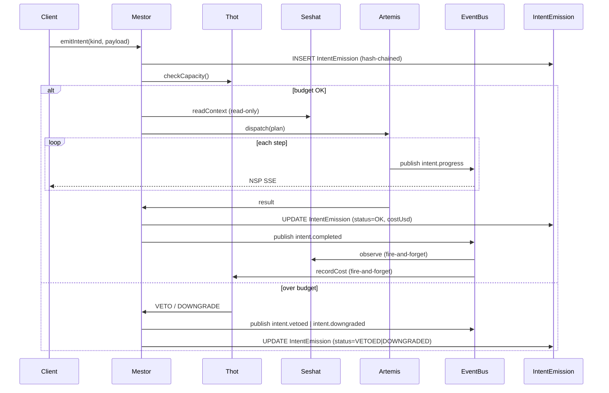
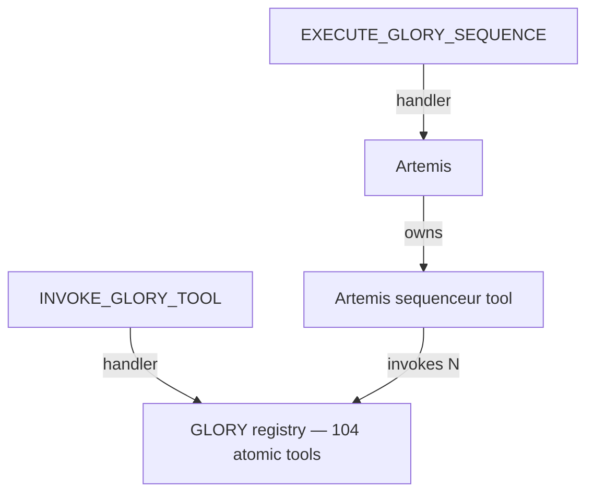

# La Fusée — Architecture (post-refonte)

## Layering (strict)

```
Layer 0 — src/domain/                  pure (PILLAR_KEYS, lifecycle, IntentProgressEvent, Zod)
Layer 1 — src/lib/                     utilities, db, auth helpers
Layer 2 — src/server/governance/       manifests, registry, event-bus, mestor, NSP server, hash-chain, tenant-scoped-db, governed-procedure
Layer 3 — src/server/services/         business services, governés (Artemis tools, Seshat ranker, Thot capacity, GLORY tools, etc.)
Layer 4 — src/server/trpc/             routers, protégés par governedProcedure ou strangler auditedProcedure
Layer 5 — src/components/neteru/       Neteru UI Kit (MestorPlan, ArtemisExecutor, SeshatTimeline, OracleEnrichmentTracker, …)
Layer 6 — src/app/, src/components/*   pages
```

Layer N peut importer ≤ N (sauf `import type` cross-layer). Enforced par
`eslint-plugin-boundaries` (config dans
[`eslint.config.mjs`](../../eslint.config.mjs)) +
`madge --circular`.

## Quartet Neteru



## Glory tools — outils intriqués



Le **sequenceur est un outil d'Artemis** qui *consomme* les outils
atomiques. Manifeste : `EXECUTE_GLORY_SEQUENCE` accepté par `artemis`,
`INVOKE_GLORY_TOOL` accepté par `glory-tools`. La dépendance
`artemis → glory-tools` est déclarée dans le manifest d'Artemis.

## Intent lifecycle

`PROPOSED → DELIBERATED → DISPATCHED → EXECUTING → OBSERVED → COMPLETED`
(ou `FAILED` / `VETOED` / `DOWNGRADED`). Chaque transition est :

1. publié sur `EventBus` (in-process, broadcast aux listeners Seshat /
   Thot / NSP server) ;
2. persisté dans `IntentEmissionEvent` (1:N avec `IntentEmission`) ;
3. streamé au client via NSP (SSE).

## Tamper-evidence

Chaque ligne `IntentEmission` porte `(prevHash, selfHash)`. `selfHash =
sha256(canonicalJson(row + prevHash))`. Le job
`governance-drift.yml` (cron hebdo) vérifie l'intégrité des 1 000
dernières lignes ; toute rupture ouvre une issue automatique.

Le seul moyen "supporté" de corriger une émission est d'émettre un
`CORRECT_INTENT` qui référence l'original. La ligne d'origine reste
immuable.

## Multi-tenant default-deny

`src/server/governance/tenant-scoped-db.ts` injecte `where: {
operatorId }` automatiquement sur tout accès `findMany / findFirst /
update / delete / create` du modèle Prisma. La whitelist `GLOBAL_TABLES`
contient les tables explicitement globales (sectors, country, llm
models, audit log lui-même).

## NSP — Neteru Streaming Protocol

- Endpoint : `GET /api/nsp?intentId=<id>&since=<iso>` → SSE.
- Persistance : `IntentEmissionEvent` permet le replay.
- Heartbeat : 15 s (anti-buffering proxy).
- Fallback : EventSource → long-poll (à câbler explicitement par les
  réseaux mobiles instables).
- Hook client : `useNeteru.intent(intentId)` (`src/hooks/use-neteru.ts`).

## CI — gates obligatoires

| Job | Bloque le merge ? | Configuré dans |
|---|---|---|
| typecheck (`tsc --noEmit`) | oui | `.github/workflows/ci.yml` |
| lint Next.js | oui | idem |
| lint governance (lafusee/*) | oui | idem |
| unit tests vitest | oui | idem |
| Prisma validate | oui | idem |
| governance audit | oui (errors) | idem |
| dep-cycle (madge) | warn (Phase 4 → error) | idem |
| commitlint | oui | idem |
| phase-label-check | oui | idem |
| scope-drift-trace | si label `out-of-scope` | idem |

## Cron — drift hebdo

`.github/workflows/governance-drift.yml` (dimanche 06:00 UTC) re-exécute
l'audit + madge, vérifie le hash-chain ; ouvre/met-à-jour une issue
`governance-drift` si problème.
