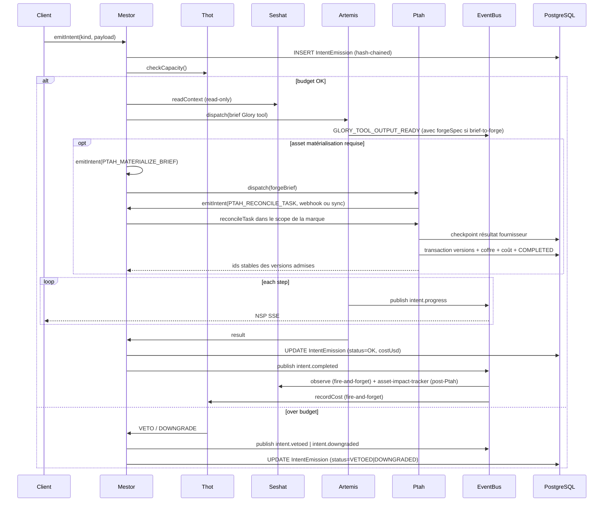
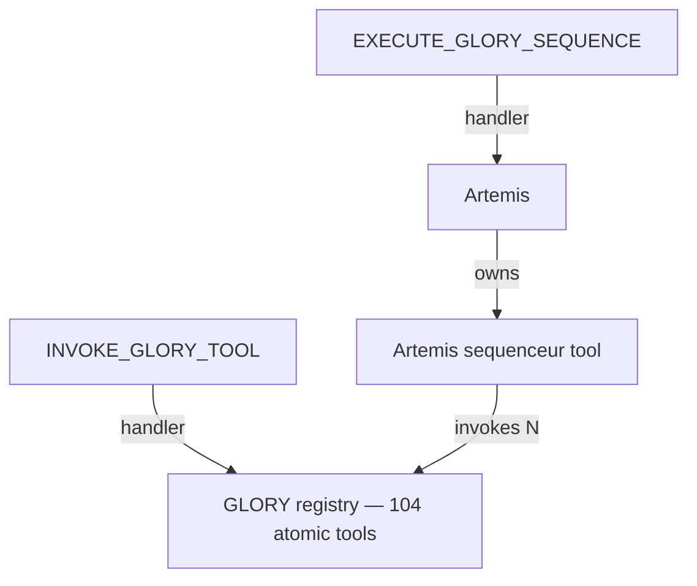

# La Fusée — Architecture (post-refonte)

## Layering (strict)

```
Layer 0 — src/domain/                  pure (PILLAR_KEYS, lifecycle, IntentProgressEvent, Zod)
Layer 1 — src/lib/                     utilities, db, auth helpers
Layer 2 — src/server/governance/       manifests, registry, event-bus, mestor, NSP server, hash-chain, tenant-scoped-db, governed-procedure
Layer 3 — src/server/services/         business services, governés (Artemis tools, Seshat ranker, Thot capacity, GLORY tools, etc.)
Layer 4 — src/server/trpc/             routers, protégés par governedProcedure ou strangler auditedProcedure
Layer 5 — src/components/neteru/       Neteru UI Kit (MestorPlan, ArtemisExecutor, SeshatTimeline, OracleEnrichmentTracker, …)
Layer 6 — src/app/, src/components/*   pages
```

Layer N peut importer ≤ N (sauf `import type` cross-layer). Enforced par
`eslint-plugin-boundaries` (config dans
[`eslint.config.mjs`](../../eslint.config.mjs)) +
`madge --circular`.

## Panthéon Neteru — cascade Glory→Brief→Forge

**7 Neteru actifs** (Mestor, Artemis, Seshat, Thot, Ptah, **Imhotep** Phase 14, **Anubis** Phase 15). Plafond APOGEE = 7 atteint. Source narrative : [PANTHEON.md](PANTHEON.md).


```mermaid
sequenceDiagram
  participant Client
  participant Mestor
  participant Thot
  participant Seshat
  participant Artemis
  participant Ptah
  participant Bus as EventBus
  participant DB as PostgreSQL

  Client->>Mestor: emitIntent(kind, payload)
  Mestor->>DB: INSERT IntentEmission (hash-chained)
  Mestor->>Thot: checkCapacity()
  alt budget OK
    Mestor->>Seshat: readContext (read-only)
    Mestor->>Artemis: dispatch(brief Glory tool)
    Artemis->>Bus: GLORY_TOOL_OUTPUT_READY (avec forgeSpec si brief-to-forge)
    opt asset matérialisation requise
      Mestor->>Mestor: emitIntent(PTAH_MATERIALIZE_BRIEF)
      Mestor->>Ptah: dispatch(forgeBrief)
      Ptah->>Mestor: emitIntent(PTAH_RECONCILE_TASK, webhook ou sync)
      Mestor->>Ptah: reconcileTask dans le scope de la marque
      Ptah->>DB: checkpoint résultat fournisseur
      Ptah->>DB: transaction versions + coffre + coût + COMPLETED
      Ptah-->>Mestor: ids stables des versions admises
    end
    loop each step
      Artemis->>Bus: publish intent.progress
      Bus-->>Client: NSP SSE
    end
    Artemis->>Mestor: result
    Mestor->>DB: UPDATE IntentEmission (status=OK, costUsd)
    Mestor->>Bus: publish intent.completed
    Bus->>Seshat: observe (fire-and-forget) + asset-impact-tracker (post-Ptah)
    Bus->>Thot: recordCost (fire-and-forget)
  else over budget
    Thot->>Mestor: VETO / DOWNGRADE
    Mestor->>Bus: publish intent.vetoed | intent.downgraded
    Mestor->>DB: UPDATE IntentEmission (status=VETOED|DOWNGRADED)
  end
```

**Frontière Ptah, code 6.27.428 livré (réception 2026-10-09)** : le résultat
checkpointé rejoint versions/coffre/coût déclaré/COMPLETED dans une transaction
sous verrou partagé du coffre et de la tâche ; reprise stable, archives préservées.
Le code 426 transmet les références métier existantes jusqu’à la tâche et relit
leur portée avant fournisseur/admission, ainsi que la tâche historique en
régénération. Le code 427 reconnaît le résultat racine ou enveloppé par Intent OK,
avec DEFERRED admis ; les refus restent des refus. Aucun service ajouté.

Suites finales : 4 167 unitaires/230 PostgreSQL/1 617 gouvernance, types/lints sans
erreur, 24 warnings, zéro cycle. HTTP Oracle 200/DEFERRED, portée/émission et
replay reçus localement sur fixtures synthétiques ; aucun fournisseur réel.
Source cdd9f6c0, CI 37862693091/image 37862922982 et runtime 428 reçus le 9 octobre
à 00:19:53 UTC, volume privé conservé ; aucune livraison 426 isolée. Production :
lectures/refus, corpus et édition SPAWT inchangés, zéro tâche/version de forge
avant/après. Ce reçu ne démontre aucun cycle réel.

L’état du bouton et sa garde opérateur sont reçus localement dans le
[code 428 livré](RECEPTION-PTAH-UX.md), gauntlet local vert :
contexte courant relu par le chokepoint existant, aucun droit ajouté. Les
acceptations C4/C5/C6, reprise DEFERRED/configuration, filiation upstream/
documentaire, octets/CDN, facture, Canva/Figma et
journal restent distincts : [reçu courant](RECEPTION-PTAH-UX.md),
[reprise interrompue historique 425](RECEPTION-PTAH-ADMISSION.md).

## Runtime 435, suivi vide SPAWT reçu — réception métier partielle

**Extension candidate 436 — décision d’état dans Guidance** : la transition
manuelle est partagée dans pillar-gateway/validation-status.ts par
strategy.validateSynthesis et pillar.transitionStatus, sous
LEGACY_PILLAR_TRANSITION_STATUS existant. Elle relit acteur/portée et verrouille
Strategy et les lignes Pillar de ses sources ; composition S canonique
ENRICHED/COMPLETE + schéma strict, version relue, fraîcheur et références
déclarées requises. S.validationStatus et Strategy.status changent dans la même
transaction, jamais confidence/content/provenance/version ; retry sans seconde
écriture, retour DRAFT rétracte Strategy VALIDATED. cross-validator et
staleness-propagator lisent la transaction existante. Aucun modèle/service/kind/
Neter/droit supplémentaire, aucune production automatique par approbation S.
La commande de projets issus des initiatives utilise une précondition S approuvé
au début de ses effets ; atomicité du cycle de production non déduite.
Quatorze PostgreSQL ciblés verts et cinq cas natifs synthétiques reçus ; autres
écrivains/consommateurs globaux et livraison finale ouverts :
[ADR-0214 Proposed](adr/0214-synthesis-approval-preserves-confidence.md) ·
[bornes](RECEPTION-VALIDATION-SYNTHESE.md).

Runtime exact 434/source 24ddb3c8/CI 37907427545/image 37907430453 reçus ; native
tracker réelle 403 pour compte non affecté, écran non reçu/trace tronquée.
435 livré : listForges seulement résout le dossier explicitement choisi pour
ADMIN effectif canonique, sans équipe par défaut ; canResume selon affectation
actuelle. Mutations/autres lectures restent strictes, aucun droit ou rôle ajouté.
Deux rouges/49 verts puis 51 PG ciblés verts. Native locale par URL connue : deux
dossiers de deux équipes, chacun sa tâche, canResume=false/lecture seule, sans
bouton ni secret ; Actualiser HTTP 200, fenêtre complète/zéro exception. Sélecteur
local 0/0 historique, copie FR finale relue, fixture nettoyée. Gauntlet 435 cinq exit 0,
gouvernance 1620/166/24 warnings préexistants ; PG complet seul 274/14, Ptah 51
inclus. CI 435 reçue : 4 180/399 unitaires et 274/14 PG ; image/runtime exact 435 reçus, source
d554276e. Native SPAWT listForges HTTP 200/zéro ligne, 403 disparu ; fenêtre complète
63 réponses/aucune ≥500/zéro exception/log. Liste du sélecteur reçue après chargement,
passage par son lien vers le portefeuille groupe FrieslandCampina non pilotable
reçu en lecture seule, portée/ambiguïtés rendues, sans métriques isolées.
Production/reprise réelle non reçue ; reload local tronqué et timings production
bornés, sans SLO déduit.

ADR-0213 Proposed étend Ptah/Intent/tâche existants par une reprise manuelle
sur brief original : portée/paramètres/sceau relus, gates actuelles puis
réservation compare-and-set avant réseau. Deux formes tRPC strictes, mélange
reprise/nouveau brief refusé avant effet ; reçu COMPLETED avec IDs AssetVersion
existants/scopés non vides. Absence de configuration garde la
même tâche ; envoi incertain interdit une réémission aveugle. Tracker et page
existants, layout OperatorSurface conservé, aucun service/router/modèle/droit.
Le spine commun utilise version existante pour un sceau v2 JSON canonique
récursif et horodate après verrou ; v1/payloads historiques inchangés. Legacy
non recalculable non vérifiable, pas altération prouvée. Sceau individuel hors
ascendance et complétion mutable ; closeEmission best-effort reste distinct.
Prérequis auth 433 séparé : callback session relit l’affectation en base, sans
tenant JWT/rôle/droit ajouté, trois rouges/verts. Marque native retrouvée,
reprise même tâche DEFERRED HTTP 200/refus reçu altéré HTTP 412 reçus ; dirigeant
sans affectation sans montage du tracker/Reprendre. Anciens compteurs par mauvais
sélecteurs écartés, nouvelle pagination native 20 puis 22 uniques reçue.
validationStatus remplace le faux vert ACTIVE,
pas les défauts confiance S absente à 0 %/validation à 1.0 sans S composé.
Deux rouges émission/trois rouges reprise, PostgreSQL actuel 270/14/Ptah 47 cas ;
types/lints/cycles/gouvernance finaux post-découplage exit 0 reçus,
1620/166 gouvernance.
CLI 1 002 lignes distingue fenêtre 1 000/--all. Horodatage = ordre logique si
le prédécesseur est futur, pas preuve d’heure métier/fraîcheur historique.
startedAt réel séparé après verrou ; horloge future 60 s, un rouge/quatre verts
puis cinq PostgreSQL verts avec clôture/durée/hash relus, aucun SLO global reçu.
Stress isolé exit 0 : 46 HTTP reçus/235 non reçus/0 échec, sans native protégée/
Glory phase 3/fournisseur réel, fixtures nettoyées. Harnais général non réparé,
heap local 8 192 MiB seulement ; stress antérieur aux dernières gardes et dates.
Suite canonique 4 180/399 et PG 270/14 finaux post-découplage reçus ; timeout
concurrent conservé/relance PG seule verte sans cause racine démontrée.
Parcours restants non reçus, CI/runtime 434 reçus. Auth 433 committée séparément,
incluse dans le bundle 434 sans runtime autonome. Production courante 435,
sept chantiers/dix gates programme non acceptés : [réception partielle](RECEPTION-PTAH-REPRISE.md).

## Glory tools — outils intriqués


```mermaid
flowchart TB
  intent[INVOKE_GLORY_TOOL]
  seq_intent[EXECUTE_GLORY_SEQUENCE]
  artemis[Artemis]
  sequenceur[Artemis sequenceur tool]
  registry[GLORY registry — 104 atomic tools]

  intent -->|handler| registry
  seq_intent -->|handler| artemis
  artemis -->|owns| sequenceur
  sequenceur -->|invokes N| registry
```

Le **sequenceur est un outil d'Artemis** qui *consomme* les outils
atomiques. Manifeste : `EXECUTE_GLORY_SEQUENCE` accepté par `artemis`,
`INVOKE_GLORY_TOOL` accepté par `glory-tools`. La dépendance
`artemis → glory-tools` est déclarée dans le manifest d'Artemis.

## Intent lifecycle

`PROPOSED → DELIBERATED → DISPATCHED → EXECUTING → OBSERVED → COMPLETED`
(ou `FAILED` / `VETOED` / `DOWNGRADED`). Chaque transition est :

1. publié sur `EventBus` (in-process, broadcast aux listeners Seshat /
   Thot / NSP server) ;
2. persisté dans `IntentEmissionEvent` (1:N avec `IntentEmission`) ;
3. streamé au client via NSP (SSE).

## Tamper-evidence

Chaque ligne `IntentEmission` porte `(prevHash, selfHash)`. `selfHash =
sha256(canonicalJson(row + prevHash))`. Le job
`governance-drift.yml` (cron hebdo) vérifie l'intégrité des 1 000
dernières lignes ; toute rupture ouvre une issue automatique.

Le seul moyen "supporté" de corriger une émission est d'émettre un
`CORRECT_INTENT` qui référence l'original. La ligne d'origine reste
immuable.

## Multi-tenant default-deny

`src/server/governance/tenant-scoped-db.ts` injecte `where: {
operatorId }` automatiquement sur tout accès `findMany / findFirst /
update / delete / create` du modèle Prisma. La whitelist `GLOBAL_TABLES`
contient les tables explicitement globales (sectors, country, llm
models, audit log lui-même).

## NSP — Neteru Streaming Protocol

- Endpoint : `GET /api/nsp?intentId=<id>&since=<iso>` → SSE.
- Persistance : `IntentEmissionEvent` permet le replay.
- Heartbeat : 15 s (anti-buffering proxy).
- Fallback : EventSource → long-poll (à câbler explicitement par les
  réseaux mobiles instables).
- Hook client : `useNeteru.intent(intentId)` (`src/hooks/use-neteru.ts`).

## CI — gates obligatoires

| Job | Bloque le merge ? | Configuré dans |
|---|---|---|
| typecheck (`tsc --noEmit`) | oui | `.github/workflows/ci.yml` |
| lint Next.js | oui | idem |
| lint governance (lafusee/*) | oui | idem |
| unit tests vitest | oui | idem |
| Prisma validate | oui | idem |
| governance audit | oui (errors) | idem |
| dep-cycle (madge) | warn (Phase 4 → error) | idem |
| commitlint | oui | idem |
| phase-label-check | oui | idem |
| scope-drift-trace | si label `out-of-scope` | idem |

## Cron — drift hebdo

`.github/workflows/governance-drift.yml` (dimanche 06:00 UTC) re-exécute
l'audit + madge, vérifie le hash-chain ; ouvre/met-à-jour une issue
`governance-drift` si problème.
