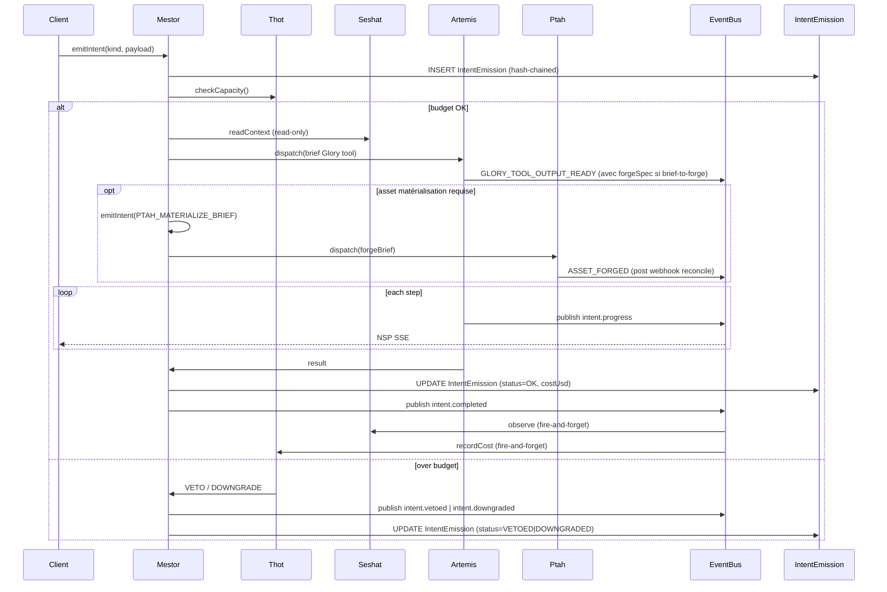
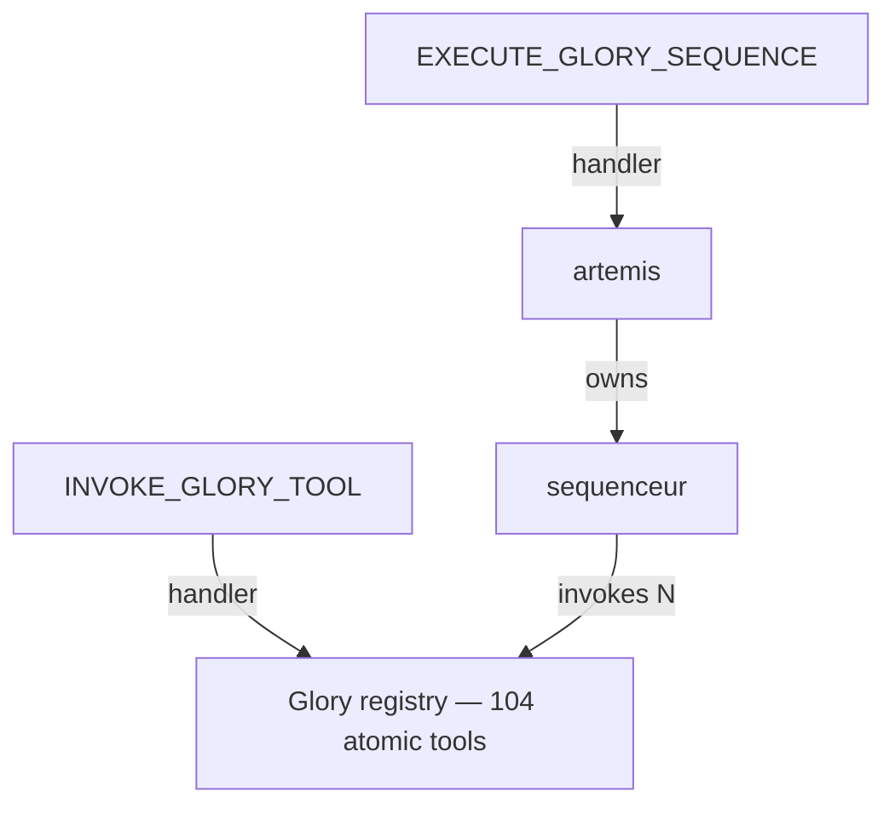

# Architecture — La Fusée Industry OS

> **Scope:** onboarding-level architecture summary. The canonical document is [docs/governance/ARCHITECTURE.md](../governance/ARCHITECTURE.md); this page repeats the essentials and points back to source files for fast navigation.

---

## 1. Executive summary

La Fusée is a **layered Next.js 16 monolith** with a **governance cascade** that turns every business mutation into a hash-chained, observable, replayable **Intent**. The architecture has three load-bearing ideas:

1. **6-layer strict hierarchy** — every file lives in a layer; a layer can only import from itself or below. Enforced at lint and CI.
2. **Mestor as single dispatcher** — no router calls a service directly; everything goes through `mestor.emitIntent({ kind, payload })`. Cost gate, pre-conditions, post-conditions, hash-chain immutability, NSP SSE streaming are all centralized.
3. **7 active Neteru as governors** — Mestor / Artemis / Ptah / Seshat / Thot / Imhotep / Anubis. Each service has a `manifest.ts` declaring its `governor` and `acceptsIntents`. Cap APOGEE = 7; never add an 8th without an ADR.

The product surface (the OS itself, what it produces, where users live) is described in [project-overview.md §2](./project-overview.md#2-three-plans-you-must-keep-separate). This page is purely about the engine.

---

## 2. Layering (strict)

```
Layer 0 — src/domain/                pure types/enums (PILLAR_KEYS, lifecycle, IntentProgressEvent, Zod)
Layer 1 — src/lib/                   utilities (db client, auth helpers, design tokens, topo-sort)
Layer 2 — src/server/governance/     manifests, registry, event-bus, Mestor dispatcher, NSP server,
                                     hash-chain, tenant-scoped-db, governedProcedure wrapper
Layer 3 — src/server/services/       business services (101 dirs) — Artemis, Ptah, Seshat, Thot,
                                     Imhotep, Anubis, LLM gateway, Glory tools, Oracle, ...
Layer 4 — src/server/trpc/           100 routers, protected by governedProcedure / auditedProcedure
Layer 5 — src/components/neteru/     Neteru UI kit (MestorPlan, ArtemisExecutor, SeshatTimeline, ...)
Layer 6 — src/app/, src/components/*  pages + ad-hoc UI
```

**Rules**

- Layer N may import from layer ≤ N. Cross-layer `import type` is allowed.
- Enforced by [`eslint-plugin-boundaries`](https://github.com/javierbrea/eslint-plugin-boundaries) configured in [eslint.config.mjs](../../eslint.config.mjs) + `madge --circular` (CI gate, warn → error in Phase 4).
- Architectural rationale: [ADR-0002](../governance/adr/0002-layering-six-couches.md).

**Key file pointers**

| Layer | Anchor file |
|---|---|
| 0 | [src/domain/index.ts](../../src/domain/index.ts), [src/domain/pillars.ts](../../src/domain/pillars.ts), [src/domain/lifecycle.ts](../../src/domain/lifecycle.ts), [src/domain/intent-progress.ts](../../src/domain/intent-progress.ts) |
| 1 | [src/lib/db.ts](../../src/lib/db.ts), [src/lib/auth/](../../src/lib/auth/), [src/lib/design/](../../src/lib/design/), [src/lib/trpc/](../../src/lib/trpc/), [src/lib/topo-sort.ts](../../src/lib/topo-sort.ts) |
| 2 | [src/server/governance/bootstrap.ts](../../src/server/governance/bootstrap.ts), [intent-kinds.ts](../../src/server/governance/intent-kinds.ts), [manifest.ts](../../src/server/governance/manifest.ts), [governed-procedure.ts](../../src/server/governance/governed-procedure.ts), [event-bus.ts](../../src/server/governance/event-bus.ts), [hash-chain.ts](../../src/server/governance/hash-chain.ts), [tenant-scoped-db.ts](../../src/server/governance/tenant-scoped-db.ts), [pillar-readiness.ts](../../src/server/governance/pillar-readiness.ts), [cost-gate.ts](../../src/server/governance/cost-gate.ts), [nsp/](../../src/server/governance/nsp/) |
| 3 | [src/server/services/mestor/](../../src/server/services/mestor/), [artemis/](../../src/server/services/artemis/), [ptah/](../../src/server/services/ptah/), [seshat/](../../src/server/services/seshat/), [financial-brain/](../../src/server/services/financial-brain/) (Thot), [imhotep/](../../src/server/services/imhotep/), [anubis/](../../src/server/services/anubis/), [llm-gateway/](../../src/server/services/llm-gateway/), [glory-tools/](../../src/server/services/glory-tools/), [oracle-section/](../../src/server/services/oracle-section/) |
| 4 | [src/server/trpc/router.ts](../../src/server/trpc/router.ts), [src/server/trpc/routers/](../../src/server/trpc/routers/) |
| 5 | [src/components/neteru/](../../src/components/neteru/) |
| 6 | [src/app/](../../src/app/), [src/components/cockpit/](../../src/components/cockpit/), [src/components/console/](../../src/components/console/), [src/components/intake/](../../src/components/intake/), [src/components/landing/](../../src/components/landing/) |

---

## 3. Governance cascade (every mutation)



**Intent lifecycle** — `PROPOSED → DELIBERATED → DISPATCHED → EXECUTING → OBSERVED → COMPLETED` (or `FAILED`/`VETOED`/`DOWNGRADED`). Each transition:

1. published on `EventBus` (in-process, broadcast to Seshat / Thot / NSP listeners);
2. persisted in `IntentEmissionEvent` (1:N with `IntentEmission`);
3. streamed to client via NSP SSE.

Source: [src/server/services/mestor/intents.ts:179](../../src/server/services/mestor/intents.ts#L179) for `emitIntent`, [src/server/governance/intent-kinds.ts](../../src/server/governance/intent-kinds.ts) for the kind registry.

---

## 4. Tamper evidence (hash chain)

Every `IntentEmission` row carries `(prevHash, selfHash)` where `selfHash = sha256(canonicalJson(row + prevHash))`. The `governance-drift.yml` cron job (Sunday 06:00 UTC) re-checks the chain on the last 1000 rows; any break files an automatic issue.

The **only supported way** to correct a past emission is to emit a `CORRECT_INTENT` that references the original. The original row is never mutated. See [ADR-0005](../governance/adr/0005-hash-chain-immutability.md).

---

## 5. Multi-tenant default-deny

[`src/server/governance/tenant-scoped-db.ts`](../../src/server/governance/tenant-scoped-db.ts) wraps Prisma and **auto-injects** `where: { operatorId }` on every `findMany / findFirst / update / delete / create` for any model that is not in `GLOBAL_TABLES` (sectors, country, llm models, audit log itself).

This means **forgetting to filter by operator does not leak data** — the wrapper closes the hole at the data layer.

---

## 6. NSP — Neteru Streaming Protocol

| Aspect | Detail |
|---|---|
| Endpoint | `GET /api/nsp?intentId=<id>&since=<iso>` → Server-Sent Events |
| Persistence | `IntentEmissionEvent` rows enable replay from any `since` cursor |
| Heartbeat | 15 s (defeats proxy buffering) |
| Fallback | EventSource → long-poll on flaky mobile networks |
| Client hook | [`useNeteru.intent(intentId)`](../../src/hooks/use-neteru.ts) and [`useNsp`](../../src/hooks/use-nsp.ts) |
| Phase 16 extension | Oracle progress streaming — 6 sub-kinds in `NspEvent` (`oracle_section_started/completed/failed`, `oracle_assembler_started/progress/done`). Cf. [ADR-0072](../governance/adr/0072-oracle-progress-streaming.md). |
| Hook for Oracle | [`useOracleStream(strategyId)`](../../src/hooks/use-oracle-stream.ts) |

Server implementation: [src/server/governance/nsp/](../../src/server/governance/nsp/).

---

## 7. The 7 Neteru (governors)

| Neter | Role | Service dir | Manifest source |
|---|---|---|---|
| **Mestor** | Guidance — Intent dispatcher unique | [services/mestor/](../../src/server/services/mestor/) | [manifest.ts:23 BRAINS](../../src/server/governance/manifest.ts) |
| **Artemis** | Propulsion (briefs phase) — Glory tools, frameworks, sequences | [services/artemis/](../../src/server/services/artemis/) | idem |
| **Ptah** | Propulsion (forge phase) — Magnific/Adobe Firefly/Figma/Canva ([ADR-0009](../governance/adr/0009-neter-ptah-forge.md)) | [services/ptah/](../../src/server/services/ptah/) | idem |
| **Seshat** | Telemetry + Tarsis weak signals | [services/seshat/](../../src/server/services/seshat/) | idem |
| **Thot** | Sustainment — fuel/budget cost gate | [services/financial-brain/](../../src/server/services/financial-brain/) | idem |
| **Imhotep** | Crew Programs — matching/talent/team/QC, Académie ([ADR-0019](../governance/adr/0019-imhotep-full-activation.md)) | [services/imhotep/](../../src/server/services/imhotep/) | idem |
| **Anubis** | Comms — broadcasts, ad networks (Meta/Google/X/TikTok), email/SMS, Credentials Vault ([ADR-0020](../governance/adr/0020-anubis-full-activation.md), [ADR-0021](../governance/adr/0021-external-credentials-vault.md)) | [services/anubis/](../../src/server/services/anubis/) | idem |

**NEFER** is **not a Neter** — it is the operator (the agent running this session) executing Intents on behalf of the user. See [NEFER.md](../governance/NEFER.md).

Cap APOGEE is 7. New external connectors (Higgsfield, Sora MCP, Runway MCP, etc.) are wired via **Anubis** as MCP connectors, not as new Neteru. See [ADR-0048](../governance/adr/0048-glory-tools-as-primary-api-surface.md) for the OAuth 2.1 device flow pattern.

---

## 8. The Oracle (key product surface)

The **Oracle** is the flagship client deliverable — a 35-section diagnostic + strategic document that auto-updates as the brand's context changes.

- **35 sections × 3 tiers**: 23 CORE, 7 BIG4_BASELINE, 5 DISTINCTIVE. Registry: [src/server/services/strategy-presentation/types.ts](../../src/server/services/strategy-presentation/types.ts) (`SECTION_REGISTRY`).
- **First-class entity** (Phase 21 F-B, [ADR-0068](../governance/adr/0068-oracle-section-first-class-entity.md)): `OracleSection` Prisma model with lifecycle `PENDING/GENERATING/COMPLETE/FAILED/STALE` + optimistic lock + TTL.
- **Manual-first orchestrator** (Phase 21 F-D, [ADR-0071](../governance/adr/0071-oracle-assembler-manual-first.md)): `ASSEMBLE_ORACLE` Intent emits N × `GENERATE_ORACLE_SECTION` instead of dispatching inline. Test `assembler-uses-manual-path.test.ts` blocks any drift back to direct LLM calls.
- **Progressive UI** (Phase 21 F-F, [ADR-0073](../governance/adr/0073-oracle-progressive-ui.md)): `useOracleStream` + `OracleProgressivePanel` render section status live as it flows through SSE.
- **Pillar amend** ([ADR-0023](../governance/adr/0023-operator-amend-pillar.md)): the only path for an operator to mutate an ADVE pillar — 3 modes (PATCH_DIRECT, LLM_REPHRASE, STRATEGIC_REWRITE). RTIS pillars are derived; never edited directly.

The Oracle is **one notable deliverable among many** — `BrandAsset.kind` covers `BIG_IDEA`, `CREATIVE_BRIEF`, `MANIFESTO`, `ORACLE_DOCUMENT`, claim, KV, etc. The cascade Glory → Brief → Forge treats every kind uniformly.

---

## 9. Glory tools — atomic operations



- **Atomic**: one Glory tool = one operation (e.g., `claim-generator`, `kv-art-direction`, `oracle-section-12`).
- **Sequence**: a topologically-ordered DAG of atomic tools (e.g., `oracle-full-sequence` = 35 sections + an assembler). Manifest declares `requires` between briefs and forges.
- **Primary public API surface** since Phase 16 ([ADR-0048](../governance/adr/0048-glory-tools-as-primary-api-surface.md)): `GloryToolDef.requiresPaidTier` gates by subscription tier; some tools route to MCP servers (`GloryExecutionType="MCP"`).

Source: [src/server/services/glory-tools/](../../src/server/services/glory-tools/), [src/server/services/artemis/](../../src/server/services/artemis/), [SERVICE-MAP.md §1 Propulsion](../governance/SERVICE-MAP.md).

---

## 10. LLM Gateway (multi-provider)

[`src/server/services/llm-gateway/`](../../src/server/services/llm-gateway/) is a v4 gateway with:

- **Multi-provider** routing (Anthropic primary, OpenAI fallback, Ollama for local embeddings).
- **Circuit breaker** per provider.
- **Cost tracking** per call (fed to Thot's cost gate).
- **`executeStructuredLLMCall`** ([ADR-0067](../governance/adr/0067-llm-output-structured-enforcement.md)) — derives a JSON schema from a Zod schema, sets `responseFormat: 'json_object'`, retries on Zod failure ×2 before bubbling `LLMStructuredCallError`. Replaces all silent coercion fallbacks.
- **Hybrid RAG** + multi-provider embeddings (Ollama → OpenAI → no-op).

Tools that issue LLM calls must declare `outputSchema?: ZodType` or `_noSchemaJustification` on their `GloryToolDef` / `FrameworkDef` — mutually exclusive at the type level.

---

## 11. CI gates (merge blockers)

| Job | Blocks merge? | Configured in |
|---|---|---|
| `typecheck` (tsc --noEmit) | yes | [.github/workflows/ci.yml](../../.github/workflows/ci.yml) |
| Next.js lint | yes | idem |
| Governance lint (`eslint-plugin-lafusee`) | yes | idem |
| Vitest unit | yes | idem |
| Prisma validate | yes | idem |
| Governance audit (`audit-governance.ts`) | yes (on errors) | idem |
| `madge --circular` | warn → error in Phase 4 | idem |
| commitlint | yes | idem |
| phase-label-check | yes | idem |
| scope-drift-trace | if PR labeled `out-of-scope` | idem |
| Mission drift | yes | [mission-drift.yml](../../.github/workflows/mission-drift.yml) |
| Governance drift (cron Sun 06:00 UTC) | n/a | [governance-drift.yml](../../.github/workflows/governance-drift.yml) |
| Golden path E2E | yes | [golden-path.yml](../../.github/workflows/golden-path.yml) |
| SLO check | yes | [slo-check.yml](../../.github/workflows/slo-check.yml) |
| Lighthouse | informational | [lighthouse.yml](../../.github/workflows/lighthouse.yml) |
| Chromatic visual | informational | [chromatic.yml](../../.github/workflows/chromatic.yml) |
| Playwright E2E | yes | [e2e.yml](../../.github/workflows/e2e.yml) |
| Preflight | yes | [preflight.yml](../../.github/workflows/preflight.yml) |

---

## 12. Where to look next

| You want to… | Read |
|---|---|
| Understand the data model | [data-models.md](./data-models.md) + [prisma/schema.prisma](../../prisma/schema.prisma) |
| Understand API surface (tRPC + REST) | [api-contracts.md](./api-contracts.md) |
| Understand directory layout in detail | [source-tree-analysis.md](./source-tree-analysis.md) |
| Set up locally, run tests | [development-guide.md](./development-guide.md) |
| Deploy, set env vars, understand cron | [deployment-guide.md](./deployment-guide.md) |
| Browse UI components | [component-inventory.md](./component-inventory.md) + [COMPONENT-MAP.md](../governance/COMPONENT-MAP.md) |
| Contribute (NEFER 8-phase) | [contribution-guide.md](./contribution-guide.md) + [NEFER.md](../governance/NEFER.md) |
| See ADR catalogue | [docs/governance/adr/](../governance/adr/) (76 ADRs as of 2026-05-13) |
| See residual debt | [RESIDUAL-DEBT.md](../governance/RESIDUAL-DEBT.md) |
| See the canonical "mot du métier ↔ entité" table | [CODE-MAP.md](../governance/CODE-MAP.md) (auto-regenerated pre-commit) |
